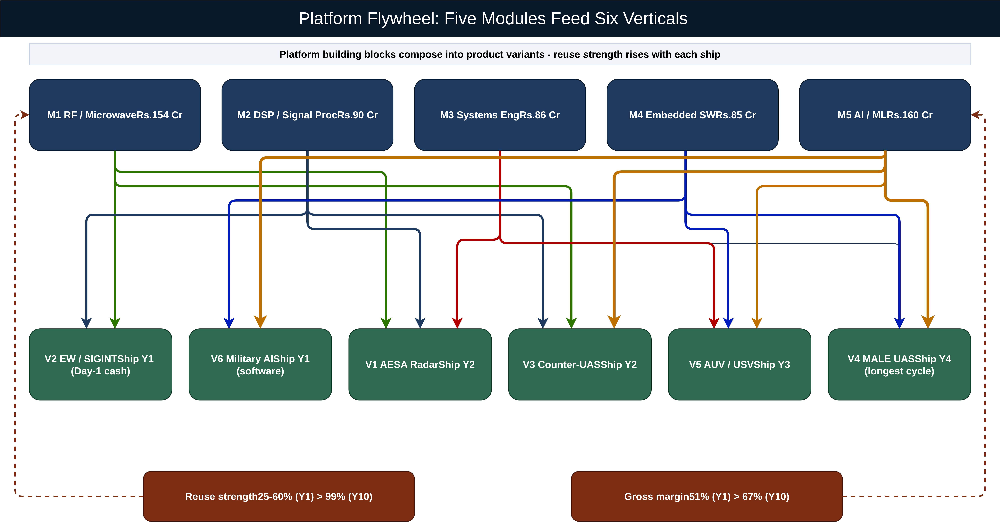
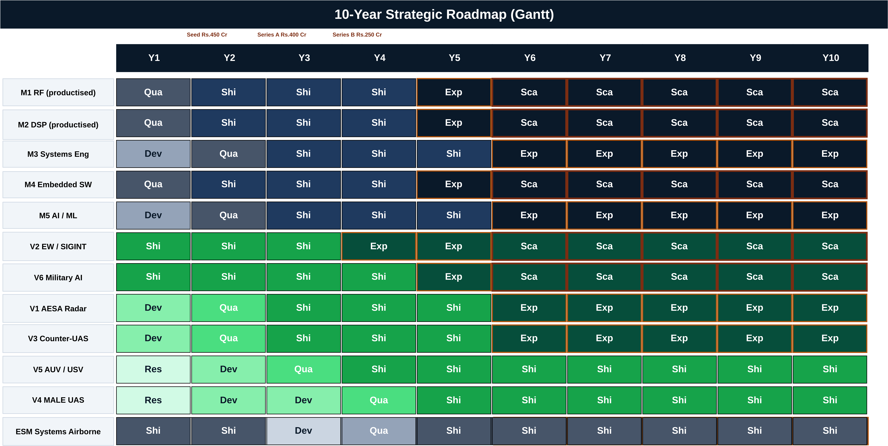
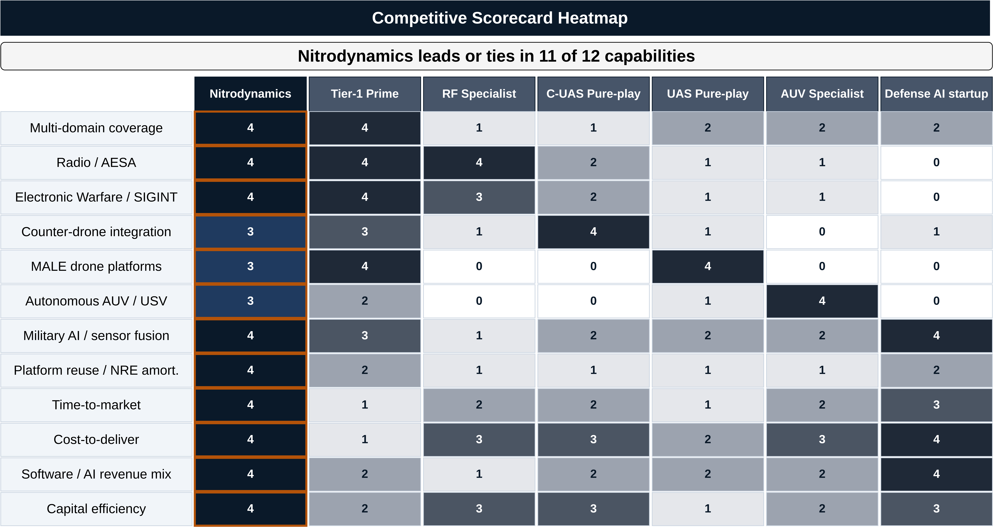
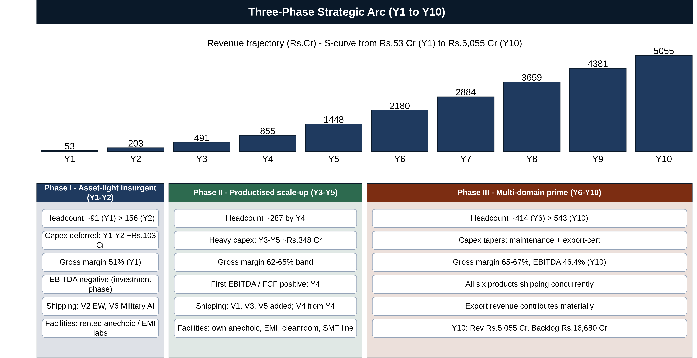
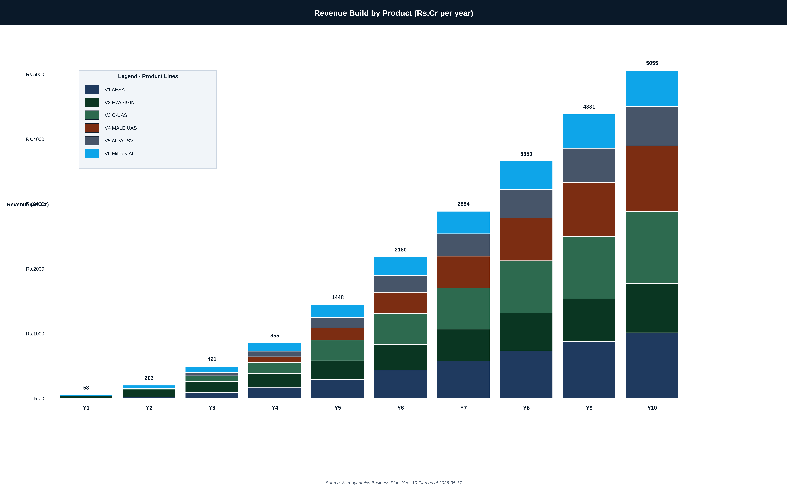
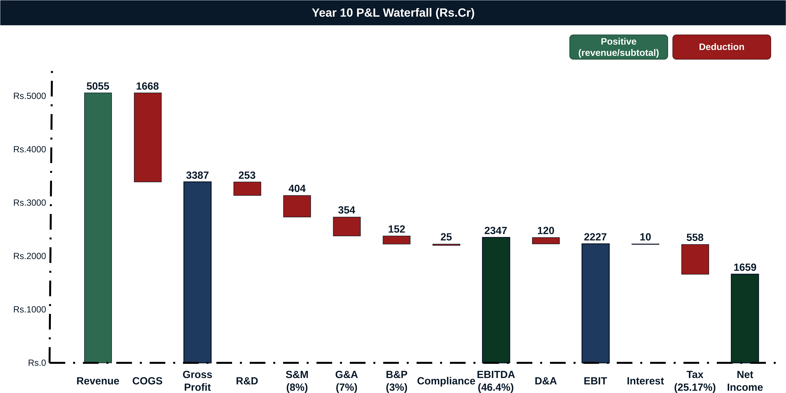
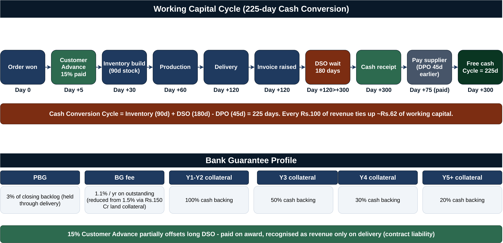
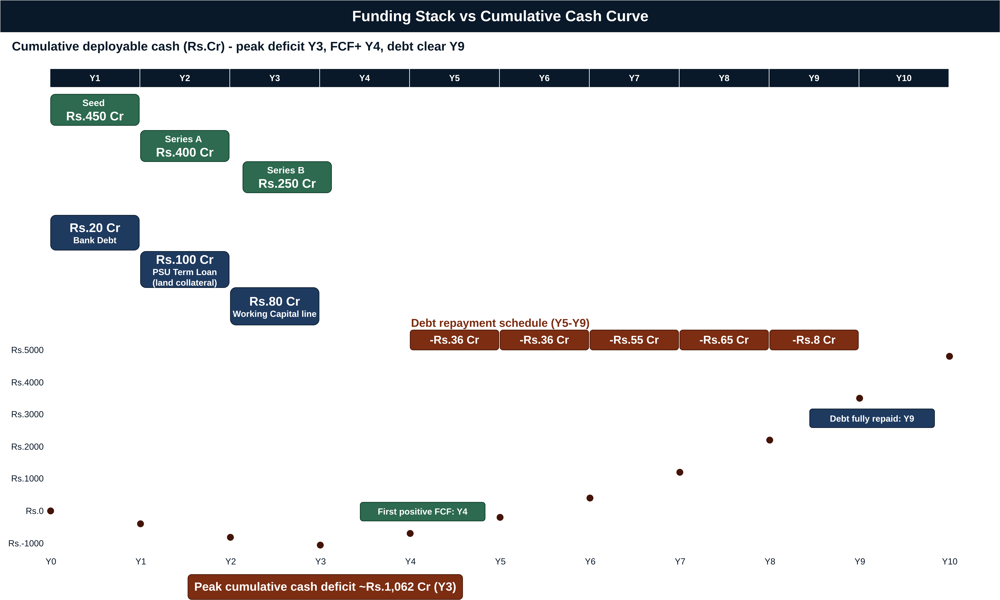
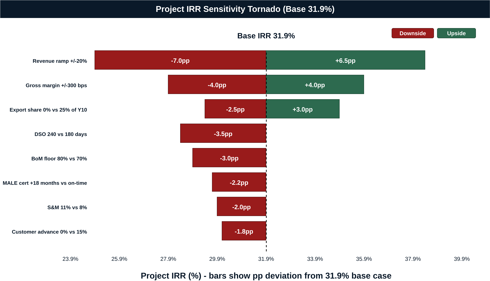
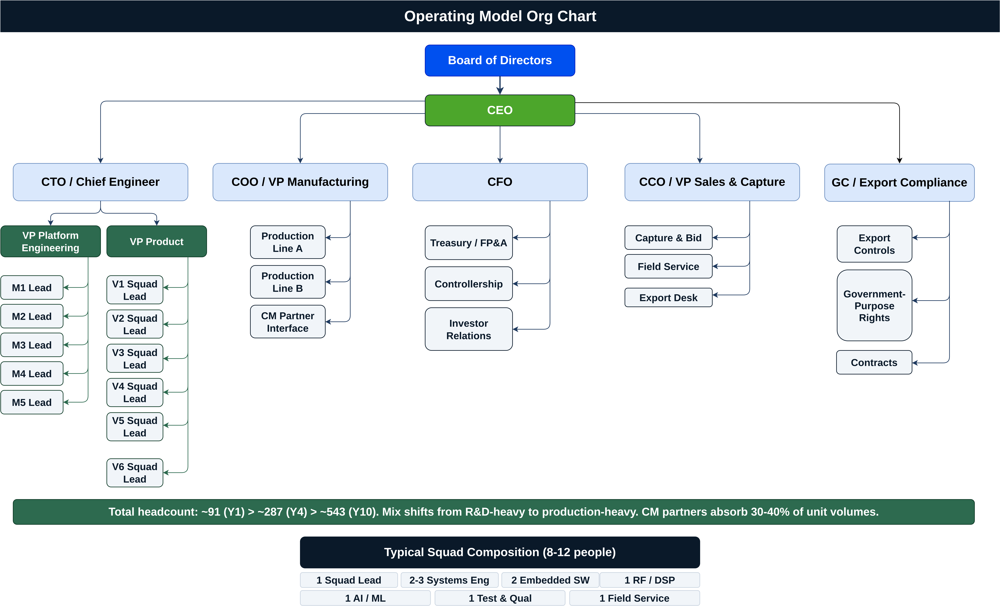

A New-Age Multi-Domain Defense Platform Company

**Investor Business Plan**

> \*\*Engineer once, deploy everywhere. \*\*


# The Investment Case

Nitrodynamics is being built as India's first **platform-native defense prime**: a single shared engineering platform (radio, signal processing, systems engineering, embedded software, AI) industrialised into six product lines across air, land, sea and cyber. Unlike legacy primes that pay the full design bill on every programme, Nitrodynamics reuses qualified building blocks at compounding efficiency, lifting blended gross margin from 51% in Year 1 to ~67% by Year 10.

A part-developed Electronic Support Measures (ESM) line with an opening order book of **Rs.105 Cr** generates cash from Year 1, funding development of the remaining five lines without requiring incremental equity for every new product. The result is a defense business that ships at software-cycle cadence (12-24 months MVP) with hardware-grade durability.

## Headline 10-Year Plan

| Metric | Value | Note |
| - | - | - |
| 10-yr cumulative revenue | Rs.21,200 Cr | Six product lines billed across the plan window |
| Year-10 revenue | Rs.5,055 Cr | Mature steady-state run-rate |
| Year-10 backlog | Rs.16,680 Cr | \>3.3x forward-revenue cover |
| Year-10 EBITDA / margin | Rs.2,347 Cr / 46.4% | vs 10-15% legacy-prime norm |
| 10-yr cumulative FCF | Rs.4,803 Cr | After tax, capex and working capital |
| Project IRR | 31.9% | Cash-flow basis |
| NPV of FCF at WACC | Rs.747 Cr | Present-value of plan FCFs |
| First positive EBITDA / FCF | Year 4 | Cash engine + reuse leverage |
| Total equity raised | Rs.1,100 Cr | Seed Rs.450 / Series A Rs.400 / Series B Rs.250 |
| Peak debt outstanding | Rs.200 Cr | Fully repaid by Year 9 |
| Capital efficiency | 4.6x Y10 revenue / 19.3x cumulative on equity | vs ~1.0x for legacy primes |

Gross margin 51%


### Three Forces Converging

1. **Demand inflection.** Post-2022 conflicts in Ukraine, Gaza, the Red Sea and the cross-border drone attacks have repriced EW, counter-drone, autonomy and ISR up the procurement queue worldwide. Indian border tensions on the northern and western fronts have made these capabilities priority capital outlay.

2. **Indian policy underwrite.** Atmanirbhar Bharat, the Positive Indigenisation Lists, DAP 2020 and a stated **Rs.50,000 Cr defense-export target by 2028-29** create durable indigenous-supplier preference in exactly the segments Nitrodynamics addresses.

3. **Platform-model validation.** Anduril (USD 1bn revenue by 2024), Shield AI (USD 2.8bn valuation 2023), Palantir defense (~USD 0.8bn run-rate), Saab Gripen and Elbit's family approach all empirically validate that platform reuse outperforms programme-by-programme economics. Nitrodynamics is the Indian execution of the same playbook with Indian-government anchor demand.

## Six Product Lines, One Platform

| Code | Product | Domain | First Ship | Strategic Role |
| - | - | - | - | - |
| V2 | EW / SIGINT (ESM) | Air, land, sea | Year 1 | Day-1 cash engine, Rs.105 Cr opening backlog |
| V6 | Military AI | All four | Year 1 | Software-led, 93-94% GM, attached to every hardware sale |
| V1 | AESA Radar (3 variants) | Air, land, sea | Year 2 | Hardware flagship, reuses ESM RF/DSP work |
| V3 | Counter-drone (layered) | Land, air | Year 2 | Highest volumes, AI-fusion showcase |
| V5 | Autonomous AUV / USV | Sea | Year 3 | Maritime expansion, autonomy reuse |
| V4 | MALE Surveillance Drone | Air | Year 4 | Longest cycle, highest unit price |


Five shared modules (M1 Radio Rs.154 Cr, M2 DSP Rs.90 Cr, M3 Systems Rs.86 Cr, M4 Embedded SW Rs.85 Cr, M5 AI/ML Rs.160 Cr; total **~Rs.575 Cr** over ten years) underpin all six lines. Module reuse strength climbs from 25-60% in Year 1 to ~99% by Year 10, taking the marginal cost of each new variant towards software and integration only. See **Diagram 1 - Platform Flywheel** and **Diagram 2 - 10-Year Roadmap Gantt**.

# Use of Proceeds (Rs.1,100 Cr Total Equity)

**Seed Rs.450 Cr (Year 1).** Platform investment (M1-M5), prototyping, qualification trials, initial production line. Unlocks ESM industrialisation and Military AI launch.

**Series A Rs.400 Cr (Year 2).** AESA + counter-drone + Military AI scale-up; EMI / anechoic facility; BG collateral. Unlocks Wave 2 ship.

**Series B Rs.250 Cr (Year 3).** AESA, MALE drone and autonomous systems first deliveries; Make-II working capital; test-range capex. Sized as the bridge to FCF-positive in Year 4.

Each round is gated by joint milestones: **platform-maturity AND contracted backlog**, never one alone. Combined with Rs.200 Cr of staggered debt and 15% customer advances, peak cumulative cash deficit is approximately Rs.1,062 Cr in Year 3. See **Diagram 7 - Funding Stack vs Cash Curve**.

## Why the Returns Compound

- **Wright's-Law learning** on Bill of Materials (0.92 factor per doubling, floored at 70% of starting BoM) takes hardware unit cost down with volume.

- **Platform reuse** moves engineering cost out of every successive product.

- **Software mix** (Military AI at 93-94% gross margin) grows fastest in the portfolio and attaches to every hardware sale.

The combined effect is a Year 10 blended GM of ~67% and EBITDA margin of ~46%, against a 10-15% legacy-prime norm. At base-case 18% WACC the cash flows deliver **31.9% project IRR and Rs.747 Cr NPV** on Rs.1,100 Cr of equity. See **Diagram 9 - P&L Waterfall** and **Diagram 10 - Sensitivity Tornado**.

# Risk at a Glance

| Risk | Mitigation |
| - | - |
| Hardware qualification slips | Small dedicated certification team; partner-lab leverage; MVP-first releases |
| Customer concentration on MoD | Six-product diversification; allied-government export pipeline from Year 2 |
| Long MoD payment cycles (DSO 180d) | 15% customer advances; venture-debt WC bridge; milestone-billing discipline |
| Cleared-engineer talent scarcity | University partnerships; software roles remote-friendly; cleared pipeline from Year 1 |
| Export-control friction (ITAR / EAR) | Dual ITAR-clean / EAR99 variants from Day 1; direct-commercial-sales workflow from Year 2 |
| Single-source RF / GaN supply | Second sources qualified by Year 3; partial in-house GaN packaging from Year 2 |


# The Ask

Lead the **Seed round of Rs.450 Cr** to capitalise the platform (M1-M5) and the Day-1 ESM industrialisation. This single tranche unlocks the entire flywheel: ESM cash from Year 1, Military AI software from Year 1, AESA and counter-drone Year 2, and the Series A pricing inflection that follows.

## Document Index

| File | Section |
| - | - |
| 00\_cover\_and\_onepager.md | This page - executive case |
| 01\_executive\_summary.md | Full executive summary |
| 02\_market\_opportunity.md | TAM / SAM / SOM, India demand drivers, comparables |
| 03\_strategy\_and\_products.md | Platform thesis, operating model, six product blocks, competitive positioning |
| 04\_financial\_model.md | Revenue architecture, GM bridge, P&L, unit economics, NWC, capex, headcount |
| 05\_funding\_and\_capital.md | Equity / debt stack, dilution maths, capital efficiency |
| 06\_returns\_and\_sensitivity.md | IRR, NPV, terminal value, sensitivity, downside / upside, comparable multiples |
| 07\_operating\_model.md | Org philosophy, squads, facilities, supply chain, talent |
| 08\_risk\_register.md | 34-risk register with inherent / residual ratings |
| 09\_governance\_compliance\_ip.md | Board, committees, MIL-STD / CMMC / ITAR, IP / GPR strategy, ESG |
| 10\_kpis\_and\_appendix.md | KPI dashboard, reporting cadence, market refs, glossary, sensitivity cheat sheet |
| Nitrodynamics\_Investor\_Diagrams.drawio | 10 investor-grade draw.io diagrams |
| Nitrodynamics\_Investor\_Plan.md | Single concatenated master document |


## Diagram Index (in Nitrodynamics\_Investor\_Diagrams.drawio)

1. Platform Flywheel - M1-M5 modules compounding into V1-V6 verticals

2. 10-Year Roadmap Gantt - module and product maturity by year, funding milestones overlaid

3. Revenue Build by Product - stacked Y1-Y10 contribution by vertical

4. Competitive Scorecard Heatmap - 12 capabilities x 7 archetypes

5. Three-Phase Strategic Arc - Asset-light insurgent \> Productised scale-up \> Multi-domain prime

6. Working Capital Cycle - 225-day CCC visualised, BG collateral schedule

7. Funding Stack vs Cash Curve - equity / debt slabs against deployable-cash polyline

8. Operating Model Org Chart - Board, CEO, five directs, platform and product squads

9. P&L Waterfall (Year 10) - Revenue Rs.5,055 Cr to Net Income

10. Sensitivity Tornado - eight single-variable swings on project IRR base 31.9%

# Executive Summary

## A. The Opportunity in One Page

Nitrodynamics is an India-headquartered multi-domain defense platform company building six product lines across air, land, sea and cyber off a single reusable engineering platform of five modules - radio and microwave, signal processing, systems engineering, embedded and mission software, and AI / machine learning.

The company starts revenue on Day 1 from a part-developed Electronic Support Measures (ESM) / SIGINT line carrying an opening order book of approximately Rs.105 Cr, then sequences AESA radar, counter-drone, autonomous maritime, MALE-class surveillance drones and Military AI into a 10-year cadence in which each new product inherits an increasing share of qualified, already-paid-for engineering from the platform.

The result is a defense prime that compounds gross margin from ~51% in Year 1 to ~67% in Year 10 and EBITDA margin to ~46.4%, against a global defense-prime benchmark of 10-15% EBITDA - achieved on Rs.1,100 Cr of total equity raised against ~Rs.21,200 Cr of cumulative 10-year revenue and a Rs.16,680 Cr closing backlog.

The investment thesis is that platform economics, demonstrated in adjacent categories by Anduril, Shield AI, Palantir and Saab, transfer cleanly to the Indian defense market at the exact policy moment the Government of India is underwriting indigenous production through Atmanirbhar Bharat, Positive Indigenisation Lists, the DPEPP 2020 framework and a Rs.50,000 Cr 2028-29 export target.

### Headline Metrics Box

| Metric | Value |
| - | - |
| 10-year cumulative revenue | Rs.21,200 Cr |
| Year-10 annual revenue | Rs.5,055 Cr |
| Year-10 closing backlog | Rs.16,680 Cr |
| Year-10 EBITDA / margin | Rs.2,347 Cr / 46.4% |
| 10-year cumulative free cash flow | Rs.4,803 Cr |
| Project IRR | 31.9% |
| NPV of FCF at WACC | Rs.747 Cr |
| Total equity raised | Rs.1,100 Cr |
| Peak debt outstanding | Rs.200 Cr |
| First positive EBITDA / FCF | Year 4 |


(see Diagram 1: Platform Flywheel; Diagram 5: Three-Phase Strategic Arc)

## B. Investment Thesis

1. **Platform economics inside a hardware vertical.** One engineering organisation, five reusable modules and six product lines drive the marginal design cost of each subsequent product from a 25% platform discount in Year 1 to a 99% discount by Year 10. Total counterfactual standalone design cost across the six lines, ~Rs.1,350 Cr, is offset by ~Rs.994 Cr of cost avoidance from platform reuse \[source: section 2\].

2. **Day-1 cash engine de-risks build-out.** The ESM/SIGINT line is already part-developed with a Rs.105 Cr opening order book, and the software-led Military AI line ships from Year 1 at 93-94% gross margin. Both generate operating cash that funds the development of AESA, counter-drone, autonomous maritime and MALE drone without re-equitising every product.

3. **Policy tailwind specific to India.** Atmanirbhar Bharat, the Positive Indigenisation Lists, DPEPP 2020 and the Rs.50,000 Cr 2028-29 export target jointly constitute the most aggressive indigenous-procurement regime in modern Indian defense history, concentrated in precisely the six segments the company addresses.

4. **Software mix expands terminal margin.** Military AI (V6) and embedded software (M4) attach to every hardware product. The resulting blended Year-10 gross margin of ~67% and EBITDA margin of ~46.4% reflect a structural software-tilt - not aggressive pricing - mirroring the trajectory Palantir's DoD business and Anduril's Lattice have publicly demonstrated.

5. **Capital efficiency well above legacy primes.** Rs.1,100 Cr of equity raised produces Rs.5,055 Cr of Year-10 revenue (4.6x) and Rs.21,200 Cr of cumulative revenue (19.3x). Legacy primes typically deliver Rs.0.6-1.0 of annual revenue per Rs.1 of equity. The plan also produces a 31.9% project IRR and crosses positive EBITDA and FCF in Year 4 - five to seven years ahead of the legacy benchmark.

## C. Use of Proceeds

The Rs.1,100 Cr equity programme is sequenced across three rounds, each gated on platform-maturity milestones and contracted backlog (see Diagram 7: Funding Stack vs Cash Curve).

The **Seed round of Rs.450 Cr in Year 1** is sized to fund the bulk of platform investment in modules M1-M5, prototyping and qualification trials, the initial production line for ESM, the first Military AI software releases, and a working-capital buffer sized for the 180-day MoD Days Sales Outstanding profile. The dominant capital sink at this stage is the platform itself, not unit production.

The **Series A round of Rs.400 Cr in Year 2** funds production scale-up across the cash-engine lines (ESM, counter-drone, Military AI), prototype builds for AESA and the MALE drone, the company's first owned EMI and anechoic facility, and the Bank Guarantee collateral pool required as backlog accumulates. Series A is the round that transitions Nitrodynamics from an asset-light insurgent to a productised OEM.

The **Series B round of Rs.250 Cr in Year 3** is the smallest round because the ESM and Military AI lines are already throwing off operating cash and Year-3 capex peaks at Rs.118 Cr. Series B funds the production ramp for AESA, the first MALE drone deliveries and autonomous systems, Make-II working capital, and test-range capex. It is sized as a bridge to free-cash-flow positive in Year 4, at which point the company self-funds. Series B is the last equity round in the plan.

A complementary Rs.200 Cr venture and term-debt stack (Rs.20 Cr venture-debt in Y1, Rs.100 Cr PSU bank term loan in Y2, Rs.80 Cr working-capital expansion in Y3) sits behind the equity, secured against Rs.150 Cr of land and factory collateral, and is fully repaid by Year 9. No reliance is placed on iDEX, TDF or Make-II grants in the base case; those are upside.

## D. Why Now

Three forces converge on this entry window.

First, **post-2022 demand for electronic warfare and counter-UAS is structurally re-rated**. The visible deployment of drones in Ukraine, the Red Sea and Gaza, and the cross-border attacks on Saudi infrastructure in 2019, have moved C-UAS and EW from optional capability to recapitalisation priority in every modern military. Markets and Markets and Mordor Intelligence forecast the counter-UAS market alone at 25-30% CAGR through 2030, reaching USD 6-7 bn. EW, at USD 22-25 bn per year globally, is the fastest-growing line item in Indian defense capital outlay.

Second, the **Atmanirbhar Bharat policy regime** has shifted the buyer's default away from import. Five successive Positive Indigenisation Lists have ringfenced specific equipment families for domestic suppliers; the Defence Production and Export Promotion Policy 2020 frames the policy intent; and the Ministry of Defence's bid evaluation explicitly prefers indigenous content. The mid-tier programme segment (below ~USD 500M lifetime value) is where this preference bites hardest, because foreign primes will not customise for it profitably.

Third, the **India MoD export target of Rs.50,000 Cr by 2028-29** is a hard, dated policy commitment. It has produced an FMS-equivalent channel for Indian exporters and active diplomatic support for sales to friendly governments. Combined with the Rs.1.7 lakh Cr Indian defense capital outlay for 2024-25, this is the most addressable defense buyer environment India has presented in three decades.

## E. Risks at a Glance

| Risk | Mitigation |
| - | - |
| Hardware qualification slip on AESA, MALE drone, AUV | Dedicated certification team, partner-lab leverage, MVP-first releases, 30% NRE contingency uplift in the model |
| Export-control restrictions (ITAR, EAR) limiting addressable buyers | ITAR-clean and EAR99 dual variants from Day 1, direct-commercial-sales workflow from Y2 |
| Long MoD payment cycle (180 days DSO) | 15% customer advances on indigenous-development contracts, venture-debt working-capital bridge, strict milestone billing |
| Single-source supply chain on RF and GaN parts | Second sources qualified by Y3, partial in-house GaN packaging capability from Y2 |


## F. The Ask

Nitrodynamics is raising Rs.1,100 Cr of equity across Seed (Rs.450 Cr, Y1), Series A (Rs.400 Cr, Y2) and Series B (Rs.250 Cr, Y3), against a 10-year plan that delivers Rs.21,200 Cr of cumulative revenue, Rs.5,055 Cr of Year-10 revenue, 46.4% Year-10 EBITDA margin and a 31.9% project IRR.

The **Seed round unlocks**: platform modules M1-M5 in qualification, ESM in series production against the Rs.105 Cr opening backlog, Military AI shipping from Year 1, and AESA and counter-drone in prototype build. End-of-tranche state - first revenue, first software cash flow, platform reuse strength 25-60%.

The **Series A round unlocks**: AESA and counter-drone qualified and in first delivery, autonomous maritime in development, owned anechoic and EMI facilities online, Bank Guarantee collateral pool established. End-of-tranche state - four product lines shipping, ~Rs.203 Cr Year-2 revenue.

The **Series B round unlocks**: MALE drone qualification, autonomous maritime first ship, AESA in volume, Y3 revenue ~Rs.491 Cr scaling to Y4 ~Rs.855 Cr. End-of-tranche state - all six products in or near production, EBITDA and FCF cross positive in Y4, no further equity required. From Y4 the company runs on operating cash plus modest term debt.

The investor outcome is a multi-domain defense prime with Rs.5,055 Cr of Year-10 revenue, a Rs.16,680 Cr backlog (over three years forward cover), software-grade margins on a hardware footprint, and a platform moat that compounds rather than depreciates.

# Market Opportunity

## A. Global Defense Spend Envelope

Global defense spending reached approximately **USD 2.4 trillion in 2023** (SIPRI), the highest real-terms figure since the end of the Cold War, driven by the war in Ukraine, sustained Indo-Pacific posturing, Red Sea maritime security operations, and broad-based recapitalisation across NATO and Indo-Pacific allies. The spend envelope is structurally re-rated: SIPRI's commentary across 2023 and 2024 indicates that the share of GDP allocated to defense is rising in over 60% of tracked economies, a multi-year trend rather than a single-cycle response.

India sits inside this envelope as the world's third- to fourth-largest defense spender. The **Indian defense budget for 2024-25 is approximately Rs.6.2 lakh Crore** (Indian MoD), of which approximately **Rs.1.7 lakh Crore is capital outlay** - the portion of the budget that buys equipment, as distinct from salaries, pensions and operations. Capital outlay is the addressable line item for a product company. Within capital outlay, the segments Nitrodynamics addresses - electronic warfare, radar, counter-drone, surveillance drones, autonomous maritime systems, and military AI - are explicitly prioritised in successive defense planning documents and constitute the fastest-growing sub-segments of Indian capital outlay.

The plan does not assume Nitrodynamics captures a disproportionate share of this envelope. It assumes the company captures low single-digit percentage shares of the relevant global sub-segments by Year 10, anchored by Indian government demand and extended by an export channel built into the plan from Year 2.

## B. Segment-by-Segment TAM / SAM / SOM

The six product lines map to six distinct addressable markets. The table below consolidates the widely reported industry sizing referenced in Appendix A of the source plan, layers a defensible India-share estimate, and shows the Nitrodynamics Year-10 target share. All global market figures and CAGRs are as reported by Mordor Intelligence, Markets and Markets, Janes, Teal Group and SIPRI commentary \[source: Appendix A\].

| Line | Global TAM (annual) | CAGR | India share (est.) | Nitrodynamics Y10 share (global) | Sources |
| - | - | - | - | - | - |
| V1 AESA radar | USD 5-7 bn | 7-9% | ~6-8% | Low single-digit % | Mordor, M&M, Janes |
| V2 EW / SIGINT | USD 22-25 bn | 6-8% | ~5-7% | Sub-1% globally, leadership in India mid-tier | Mordor, Janes, SIPRI |
| V3 Counter-drone | USD 2-3 bn rising to USD 6-7 bn by 2030 | 25-30% | ~7-10% | Low single-digit % | M&M, Mordor |
| V4 MALE-class UAS | USD 4-5 bn | 8-10% | India needs 70-100 airframes over the decade | Sub-1% globally, materially higher in India | Janes, Teal Group |
| V5 Unmanned maritime (AUV/USV) | USD 2.5-3.5 bn | 12-15% | ~6-9% | Low single-digit % | Mordor, Janes |
| V6 Defense AI software | USD 8-12 bn today, ~3x by 2030 | 20%+ | Emerging | Sub-1% globally, anchor share in Indian platforms | Palantir/Anduril public reference points |


Two structural points follow. First, the **aggregate TAM is on the order of USD 45-55 bn per year today, growing to roughly USD 80-100 bn by 2030**, even on the conservative end of the cited CAGRs. The Year-10 Nitrodynamics revenue of Rs.5,055 Cr (~USD 600M at long-run FX) represents well under 1% of this envelope - the plan does not require category dominance, only disciplined share capture in the segments where the company has structural advantages.

Second, the **highest-growth segments (counter-drone at 25-30% CAGR, defense AI at 20%+ CAGR, unmanned maritime at 12-15% CAGR) are precisely those where platform reuse compounds fastest**, because each is software-led or sensor-fusion-led. The slower-growing but larger segments (EW at USD 22-25 bn growing 6-8%, AESA at USD 5-7 bn growing 7-9%) are where Nitrodynamics already has Day-1 product and where the cash engine sits. The portfolio is a barbell of mature large categories funding entry into faster-growing categories.

(see Diagram 3: Revenue Build by Product)

# C. India-Specific Demand Drivers

India is the unusual case of a top-five global defense buyer that has explicitly decided, as a matter of national policy, to indigenise. The policy stack and the visible procurement programmes jointly constitute the demand-side argument.

## Policy stack.

- **Atmanirbhar Bharat (Self-Reliant India).** The umbrella policy direction announced in 2020, framing indigenous defense production as a national priority and biasing MoD evaluation toward domestic suppliers in qualifying categories.

- **Positive Indigenisation Lists.** Five successive lists issued by the MoD ringfencing specific equipment families for domestic procurement only, with phased import bans. EW, radar, counter-drone, UAS and autonomous systems are all represented.

- **Defence Production and Export Promotion Policy (DPEPP) 2020.** The formal policy document codifying the targets, including the Rs.50,000 Cr 2028-29 export target and the indigenisation roadmap.

- **Rs.50,000 Cr annual defense exports by 2028-29.** A dated, public commitment that has translated into active government support for indigenous exporters (Lines of Credit, government-to-government channels, FMS-equivalent processes).

**Current procurement programmes named in the source plan.** Indian EW procurement runs through **Samyukta** and **Himshakti** for the Army, **Sangraha** and **Varuna** for the Navy, and pod-based EW for the Air Force. The **Uttam AESA** programme by DRDO-LRDE is the indigenous reference for radar, and the MoD's stated direction is to replace imported radars with domestic alternatives wherever performance allows. The **Project 75 follow-on** and the indigenous AUV programme at NSTL Vizag are the visible procurement vectors for unmanned maritime. Counter-drone is being procured across Army (border), Air Force (airbase protection), Navy (ship-borne) and paramilitary / critical-infrastructure operators. The 2024 MQ-9B Sea Guardian acquisition underlines that MALE-class capability is in active procurement and is now politically acceptable as a domestic build target.

The aggregate signal is that **Indian demand is not speculative**. It is named, scheduled, and politically protected. The remaining commercial question is which suppliers win, not whether the market exists.

# D. Comparable Companies & Validation

The platform thesis is empirically validated by adjacent precedents. The source plan references the following comparables as proof points; the validation each provides is summarised below.

| Comparable | What it validates |
| - | - |
| **Anduril Industries** | Reached unicorn status in 2020 and reported to have crossed USD 1 bn revenue by 2024, on a comparable platform approach. Demonstrates that a multi-product modular defense company can scale at software-company velocity. Lattice is the public archetype for sensor-fusion middleware comparable to V6 AI-C. |
| **Shield AI** | Raised at a USD 2.8 bn valuation in 2023 against an autonomy stack. Validates that defense autonomy software commands software-grade valuations and margins. |
| **Palantir** | Defense business reached approximately USD 0.7-0.8 bn of annual run-rate from US DoD alone by 2024 (company filings). Validates that operational decision-support software is a real, large, high-margin defense category - the reference for V6 AI-B (OIDSS). |
| **Saab** | Grew Gripen, GlobalEye and EW lines off a common avionics and sensor stack. Demonstrates that platform reuse is a viable strategy for a multi-domain hardware prime, not just for software companies. |
| **Elbit Systems** | Skylark and Hermes drone families share mission computers and ground stations across multiple sizes. Validates that drone families can be productised around a shared platform rather than re-engineered per airframe. |
| **Baykar (Bayraktar Akinci)** | Demonstrates that a mid-sized national champion can productise MALE-class UAS and become a global exporter inside a decade, against incumbent OEMs. |
| **IAI (Heron-TP)** | Reference MALE / surveillance platform in active export. Validates the price points and the buyer base. |
| **General Atomics (MQ-9 Reaper)** | The global reference comparator for V4. India's MQ-9B Sea Guardian acquisition is the demand-side counterpart. |


Two of these comparables - Anduril and Saab - validate the platform thesis itself. The other six validate the product-line-specific demand and economics. Taken together, the playbook Nitrodynamics is executing has been independently demonstrated in adjacent markets; what is novel is its application by an Indian company at this policy moment.

## E. Market Segments

The addressable buyer set is heterogeneous. The portfolio is structured to serve each persona without rebuilding the underlying platform.

### Indian Ministry of Defence, service-wise.

- **Indian Army.** Border EW (Samyukta, Himshakti), counter-drone for border posts and forward bases, AUVs for inland water operations, edge AI. Volume buyer for the soldier-portable CUAS-A and the vehicle-mounted CUAS-B variants. Procurement cycles are long but volumes are high and the political will to indigenise is strong.

- **Indian Navy.** Naval ESM (Sangraha, Varuna) on warships, AUVs for mine-hunting and seabed warfare, USVs as surveillance and C-UAS hosts, AESA naval radar variant. The Navy is the procurement vector for V5 maritime autonomy and for the EW-A variant.

- **Indian Air Force.** Airbase counter-drone, aerial ESM pods (EW-B), the airborne AESA variant on fighters and drones, MALE-class UAS (V4) for surveillance and strike. The IAF is the lead buyer for V1 airborne and V4.

- **Paramilitary forces.** Counter-drone (CUAS-A and CUAS-C variants) for VIP protection, border patrol and counter-insurgency. Faster procurement cycles than the regular services.

- **Critical-infrastructure operators.** Civil airports, refineries, power plants and ports buying CUAS-C fixed-site installations. This is the Indian analogue of the post-2019-Saudi-Aramco corporate counter-drone market and is procured outside the MoD channel, with shorter cycles.

 From Year 2 onward, the export channel targets friendly governments in South Asia, Southeast Asia, the Middle East and Africa. The relevant variants are ITAR-clean / EAR99-only versions of the EW, counter-drone, MALE drone and Military AI lines, supported by the Government of India's emerging FMS-equivalent channel and direct commercial sales. The Rs.50,000 Cr 2028-29 export target is the policy backdrop; specific country pipelines are built around offset partnerships and government-to-government Lines of Credit.

The portfolio's six-product breadth is itself a hedge against customer concentration: no single service-buyer combination represents more than a fraction of Year-10 revenue.

# F. Why the Mid-Tier Programme Segment Is Structurally Mispriced

Nitrodynamics competes in the **mid-tier programme segment, defined as defense programmes below approximately USD 500 million in lifetime value** \[source: section 7\]. This tier is structurally mispriced for two reasons.

**The tier-1 primes (Lockheed Martin, RTX, Northrop Grumman, BAE Systems, Leonardo, Thales) cannot service the tier profitably.** Their overhead structures - bid and proposal teams, programme directorates, compliance organisations, indirect cost pools - are built for programmes of USD 1 bn+ lifetime value. Inside a USD 100-500 M programme, those overheads consume a disproportionate share of revenue, and the engineering reuse the tier-1s practice is fragmented across enough country variants that the marginal design cost per new programme remains high. The tier-1s win these programmes only when they have to - as offset obligations against larger contracts - and they execute them as loss leaders.

**The pure-play single-product specialists (the RF specialists, the C-UAS pure-plays, the UAS pure-plays, the AUV specialists, the defense-AI startups) cannot address multi-domain integrated procurements.** Modern Indian programmes increasingly bundle EW with AESA with C-UAS with AI fusion in a single award, because the customer wants a single integrator and a single throat-to-choke. A pure-play vendor can only bid for one slice and must partner for the rest, which means it loses prime-contractor margin and loses control of the integration stack.

This leaves the mid-tier programme segment under-served by both ends of the market. The structural opportunity is to operate at the platform economics of the tier-1s but at the overhead structure and cycle time of the pure-plays - which is precisely what a five-module platform serving six product lines is engineered to do. The competitive scorecard in section 7 of the source plan, reproduced in the strategy section of this pitch, captures this gap quantitatively: Nitrodynamics scores 4s on time-to-market, cost-to-deliver, capital efficiency and platform reuse while matching the tier-1s on multi-domain coverage.

The mid-tier segment is large in absolute terms. Within India's Rs.1.7 lakh Cr annual capital outlay, the share addressable by programmes below USD 500M lifetime value is the majority of programme count and a substantial share of programme value. Globally, in the segments listed in section B above, the mid-tier share of addressable programmes is well above 50% by count. This is the structural commercial opportunity the plan monetises.

# Strategy, Operating Model & Product Portfolio

# A. The Platform Thesis

Nitrodynamics is engineered around a single proposition: **one investment in a shared engineering platform, six product lines across four domains, with each successive product inheriting a rising share of qualified work from the platform**. The five modules - M1 Radio and Microwave, M2 Signal Processing, M3 Systems Engineering, M4 Embedded and Mission Software, and M5 AI / Machine Learning - are not abstractions. Each is a defined engineering deliverable with a measurable maturity trajectory, a budget, and a reuse-strength curve that rises from 25-60% in Year 1 to ~99% by Year 10.



The economic shape of the platform thesis is that the total counterfactual cost of designing the six product lines as standalone programmes is approximately Rs.1,350 Cr, against which platform reuse delivers approximately Rs.994 Cr of cost avoidance over the 10-year horizon \[source: section 2\]. The Rs.575 Cr of platform investment summarised below is the firm's true capital expenditure; everything else compounds off it.

| Module | What it contains | 10-year platform investment (Rs.Cr) |
| - | - | - |
| M1 Radio and Microwave | T/R modules, GaN power amplifiers and LNAs, beamforming, antennas | ~154 |
| M2 Signal Processing | Real-time FPGA pipelines, SDR firmware, digital beamforming | ~90 |
| M3 Systems Engineering | Hardening, environmental qualification, EMI/EMC and verification framework | ~86 |
| M4 Embedded and Mission Software | RTOS, mission-computer software, C2, cybersecurity, MOSA/FACE compliance | ~85 |
| M5 AI / Machine Learning | Computer vision, sensor fusion, autonomy, ML operations | ~160 |
| **Total** |  | **~575** |


The platform thesis is empirically validated in adjacent markets. Saab's Gripen E reuses the avionics core from the C/D. Elbit's Skylark and Hermes drone families share mission computers and ground stations across multiple airframe sizes. The Boeing 787 and the Airbus A350 share avionics with subsequent variants. Lockheed's F-16 has been in production for fifty years partly because of the discipline of reuse across blocks. The novelty in Nitrodynamics is not the idea but the discipline of organising the company around it from Day 1, rather than retrofitting it onto a programme-directorate structure that fights reuse \[source: section 6\].

# B. Operating Model

The company operates more like a software firm shipping defense-grade hardware than a traditional defense contractor (see Diagram 8: Operating Model Org).

**Product squads, not programme directorates.** A small cross-functional team owns each product line end to end, from architecture through to field deployment. This is the inverse of the legacy prime model, in which a programme office coordinates across functional silos and pays the coordination tax in cycle time.

**12-24 month MVP cycles.** Software-led products ship a fielded minimum viable product within 12 to 24 months. Hardware variants that reuse already-qualified modules ship in 24 to 36 months. The legacy benchmark is 5 to 7 years per programme. The cycle compression is achieved by aggressive reuse, MOSA/FACE open architecture, and MVP-first releases that put a fielded product in customer hands before final variant work completes.

**Concurrent development and production.** The ESM line generates cash from Year 1, which funds development of the remaining five lines in parallel. The company is never in a position where one product must finish before the next can start. This concurrency is what enables six product lines to be in the field by Year 4.

**Asset-light Years 1-2, owned facilities from Year 3.** In Phase I (Years 1-2), the company rents anechoic chambers, EMI/EMC test cells and outdoor ranges from partner labs. Y1-Y2 combined gross capex is ~Rs.103 Cr. Owned facilities (anechoic chamber, EMI/EMC cell, SMT cleanroom, GaN packaging, UAS flight-test hangar, maritime test tank) come online from Year 3 as volume justifies the investment - Y3-Y5 combined gross capex is ~Rs.348 Cr. Total 10-year gross capex is ~Rs.600 Cr \[source: section 9.6\].

**MOSA / FACE open architecture.** Every product uses the same mission computer, command-and-control software and cybersecurity baseline. This is the formal US DoD requirement under MOSA / FACE standards. The strategic value is twofold: it is a hard customer requirement on FMS-eligible variants, and it is the architectural precondition for module reuse.

**Compliance and IP posture.** AS9100 and CMMI Level 3 for quality, CMMC Level 3 for cybersecurity (adopted because it is the most demanding standard and FMS exports benefit from already meeting it), MIL-STD-810/461/704/1275 for hardware, DO-178C/254 for airborne software and hardware. Default IP posture is Government-Purpose Rights, with platform IP retained across all programmes regardless.

# C. Wave Plan



| Wave | Year | What ships |
| - | - | - |
| Wave 1 | Year 1 | ESM (V2) in production against Rs.105 Cr opening backlog; Military AI (V6) shipping; M1, M2, M4 modules productised |
| Wave 2 | Year 2 | AESA radar (V1) first delivery; Counter-drone (V3) fielded as MVP; both reuse the radio and DSP work from ESM |
| Wave 3 | Year 3 | Autonomous AUV/USV (V5) begins shipping, reusing the AI/autonomy stack |
| Wave 4 | Year 4 onward | MALE-class surveillance drone (V4) reaches initial production after clearing DO-178C/254 and type certification; all other lines continue scaling; allied-government exports become material |


By Year 5 all six product lines are shipping concurrently. By Year 6 export contracts contribute materially to revenue and operating profit is structural rather than cyclical.

# D. Six Product Lines

### V1 - AESA Radar (first ship Year 2)

A modern electronically scanned array radar in three variants: an X-band airborne version for fighters and large drones, an S-band version for ground surveillance, and an X-band naval version for warships. Selling prices range from approximately **Rs.22 Cr to Rs.45 Cr per unit** depending on variant, with the Bill of Materials approximately one-third of the selling price and falling with volume. Annual volumes scale from a single demonstrator unit in Year 1 to **~95 units per year by Year 10** across all three variants. The first variant reuses about half its design from the ESM line in Year 1, rising to ~99% reuse by Year 10. Heavy reuse of M1 Radio and Microwave, M2 Signal Processing, and M3 Systems Engineering.

**Key comparables.** Northrop Grumman, Raytheon, Leonardo, Saab, Thales, Indra on the global tier-1 side; DRDO-LRDE's Uttam AESA as the indigenous reference.

**Why this is plausible.** Global AESA production is concentrated in a handful of primes plus the Russian and Chinese state primes. India currently imports or jointly produces almost all its AESAs. The MoD's stated direction is to replace imported radars with domestic alternatives wherever performance allows. The global market is USD 5-7 bn per year at 7-9% CAGR (Mordor Intelligence, Markets and Markets). The Year-10 Nitrodynamics share is a low single-digit percentage of the global market, anchored by Indian MoD demand for the three services and supplemented by export.

### V2 - Electronic Warfare and SIGINT (first ship Year 1, opening order book Rs.105 Cr)

The Day-1 cash engine. Four variants:

- **EW-A**, naval ESM/ELINT suite on warships: **Rs.25-30 Cr each**, 4 to 15 units a year.

- **EW-B**, aerial ESM pod for aircraft and large drones: **Rs.29-35 Cr**, 1 to 20 a year.

- **EW-C**, tactical anti-drone jammer (highest-volume variant): **Rs.1.7-2.0 Cr**, 6 to 80 a year.

- **EW-D**, strategic ground-based SIGINT station (flagship contracts): **Rs.95-114 Cr per station**, 0 to 8 a year.

The line is already part-developed on Day 1. Year 1 focus is industrialisation, qualification and scale-up of production and sales pipeline.

**Key comparables.** Saab and Elbit on the integrated EW side; a wide field of EW specialists otherwise.

**Why this is plausible.** Indian EW procurement runs across Army EW (Samyukta, Himshakti), Navy ESM (Sangraha, Varuna) and Air Force pod-based EW. SIPRI and Janes both note EW as among the fastest-growing line items in Indian capital outlay, driven by border tensions on the northern and western fronts. The global EW market is USD 22-25 bn per year at 6-8% CAGR. The opening Rs.105 Cr backlog reflects existing commercial commitments brought into the company.

### V3 - Counter-drone (first ship Year 2)

A layered counter-drone system combining radar, RF detection, electro-optical and infrared cameras, AI fusion, and both soft-kill (jamming) and hard-kill (destruction) effectors.

- **CUAS-A**, soldier-portable kit: **Rs.1.5 Cr each**, 10 to 320 a year.

- **CUAS-B**, vehicle-mounted system: **Rs.14.25 Cr each**, 3 to 56 a year.

- **CUAS-C**, fixed-site installation around airports, refineries and military bases: **Rs.65 Cr each**, 1 to 7 a year.

First MVP fielded in Year 2 using the shared radio, DSP and AI building blocks. Scaled aggressively from Year 3. This is the highest-unit-volume product in the portfolio.

**Key comparables.** A field of C-UAS pure-plays (e.g. DroneShield, Dedrone, Anduril's Pulsar) plus tier-1 integrators bundling C-UAS into wider air-defense.

**Why this is plausible.** The C-UAS category is the most explicit growth segment globally after visible drone use in Ukraine, Gaza, the Red Sea, and the 2019 attacks on Saudi infrastructure. Markets and Markets and Mordor Intelligence both forecast 25-30% CAGR through 2030, reaching USD 6-7 bn. Indian demand spans Army, Air Force, Navy, paramilitary and critical infrastructure - the broadest buyer base in the portfolio.

### V4 - MALE-class Surveillance Drone (first ship Year 4)

The longest-cycle product because of airframe engineering and the formal airworthiness certification process (DO-178C software, DO-254 hardware, plus type certification). Cycle compression is achieved through the open-architecture mission computer and the reuse of the AI building blocks.

- **UAS-A**, surveillance baseline: **Rs.150 Cr**, 1 to 7 a year.

- **UAS-B**, strike-capable variant: **Rs.210 Cr**, 1 to 3 a year.

- **UAS-C**, SIGINT / EW mission variant: **Rs.200 Cr**, 1 to 4 a year.

Heavy reuse of M3 Systems Engineering, M4 Embedded Software and M5 AI / ML; M1 and M2 contribute the EW mission payload on UAS-C.

**Key comparables.** General Atomics (MQ-9 Reaper), Baykar (Bayraktar Akinci), IAI (Heron-TP), AVIC (Wing Loong).

**Why this is plausible.** India's MQ-9B Sea Guardian acquisition from the US (announced 2024) underlines that the category is in active procurement. Janes places the global MALE UAS market at USD 4-5 bn per year, with India alone projected to need 70-100 MALE-class aircraft across the three services across the next decade. Domestic production has clear policy tailwinds and Baykar's trajectory establishes that a national champion can capture this category from a standing start.

### V5 - Autonomous Underwater and Surface Vessels (first ship Year 3)

- **AUV-A**, small underwater vehicle for mine-hunting and seabed survey: **Rs.15 Cr each**, 1 to 32 a year.

- **AUV-B**, large anti-submarine AUV: **Rs.60 Cr**, 1 to 4 a year.

- **USV-A**, mid-size unmanned surface vessel used as a surveillance and counter-drone host: **Rs.45 Cr**, 1 to 15 a year.

Autonomy software is shared with V6. Hulls are iterated rapidly through partner shipyards rather than built in-house, keeping the line asset-light.

**Key comparables.** Anduril (Dive-LD, Ghost Shark), L3Harris, Saab (Sea Wasp / AUV62), Kongsberg.

**Why this is plausible.** Unmanned maritime is the next-wave equivalent of what aerial drones were a decade ago. The US Navy's Task Force 59 in the Middle East, Australia's Ghost Shark large-AUV programme and the Ukrainian Magura USV strikes in the Black Sea have made the strategic case in public. The Indian Navy is procuring AUVs for mine countermeasures and seabed warfare, visible in the Project 75 follow-on and the indigenous AUV programme by NSTL Vizag. Global market USD 2.5-3.5 bn per year at 12-15% CAGR.

### V6 - Military AI Systems (first ship Year 1)

A software-led family on a software-defined release cadence.

- **AI-A**, edge AI mission box that bolts onto existing military platforms: **Rs.3.8 Cr each**, 2 to 55 a year.

- **AI-B**, OIDSS (operational intelligence and decision-support software), sold as an annual licence: **Rs.11.4 Cr per licence per year**, 1 to 35 licences a year.

- **AI-C**, sensor-fusion middleware licence: **Rs.5.7 Cr**, 2 to 52 a year.

Highest gross margins in the portfolio (93-94%). Attached to every hardware product so that every AESA, ESM, C-UAS, drone and AUV pulls software revenue.

**Key comparables.** Palantir (defense decision-support; USD 0.7-0.8 bn DoD run-rate by 2024 per filings), Anduril (Lattice sensor-fusion), Shield AI (autonomy; USD 2.8 bn valuation in 2023).

**Why this is plausible.** The thesis that defense AI is a high-growth, high-margin software category is empirically validated by Palantir, Anduril and Shield AI. What is novel here is bundling it with the firm's own hardware lines rather than selling it standalone, which both improves software attach rates and lifts blended hardware margin.

## E. Platform Reuse Mechanics

The plan's terminal margin trajectory is not a function of pricing; it is the arithmetic consequence of three compounding mechanics.

**Reuse strength climbs from 25-60% in Year 1 to ~99% by Year 10.** In Year 1 a new product can reuse only the fraction of the platform that has already been qualified - which is small, because the platform itself is still being built. By Year 5, a new variant inherits 80-90% of its design from already-proven modules. By Year 10 the foundation is essentially complete and a new variant inherits it virtually free. The reuse curve is the same dynamic that lets a modern smartphone maker release a new model annually despite the underlying technology being extraordinarily complex: the platform absorbs most of the engineering cost.

**Wright's-Law learning compresses the Bill of Materials.** The plan applies a **0.92 learning factor** - an 8% cost reduction per doubling of cumulative production - **floored at 70% of the starting BoM**. This is the conservative end of the historical range; aerospace and electronics learning factors are typically 0.85-0.92. Combined with a 30% NRE contingency uplift baked into the model, the cost-down trajectory is engineered not to over-claim. On volume products (CUAS-A, EW-C, AI-A) the BoM is at or near its 70% floor by Year 7-8.

**Software mix lifts blended gross margin.** Year 1 revenue is hardware-heavy and the gross margin is ~51%. As Military AI (93-94% gross margin) scales faster than the hardware lines, and as every hardware sale pulls attached software revenue, the blended Year-10 gross margin rises to ~67% and the EBITDA margin to ~46.4%. The legacy defense-prime benchmark is 10-15% EBITDA; the delta is the software-tilt plus the platform-reuse leverage, not pricing power.

The combined effect on the cost side is captured by the design-cost discount: rising from 25% in Year 1 to 99% by Year 10. The combined effect on the revenue side is that every shipped product (V1-V6) returns both revenue and incremental module maturity, which lowers the design cost of the next product. By Year 10 the loop is self-sustaining without further equity capital (see Diagram 1: Platform Flywheel).

# F. Competitive Positioning

Nitrodynamics competes in the mid-tier programme segment (below ~USD 500M lifetime value), where the tier-1 primes are structurally unprofitable on overhead and where pure-plays cannot address multi-domain integrated procurements. The 0-4 scorecard from the source plan is reproduced below.



| Capability | Nitrodynamics | Tier-1 Prime | RF Specialist | C-UAS Pure-play | UAS Pure-play | AUV Specialist | Defense AI startup |
| - | - | - | - | - | - | - | - |
| Multi-domain coverage | 4 | 4 | 1 | 1 | 2 | 2 | 2 |
| Radio / AESA | 4 | 4 | 4 | 2 | 1 | 1 | 0 |
| Electronic Warfare / SIGINT | 4 | 4 | 3 | 2 | 1 | 1 | 0 |
| Counter-drone integration | 3 | 3 | 1 | 4 | 1 | 0 | 1 |
| MALE drone platforms | 3 | 4 | 0 | 0 | 4 | 0 | 0 |
| Autonomous AUV/USV | 3 | 2 | 0 | 0 | 1 | 4 | 0 |
| Military AI / sensor fusion | 4 | 3 | 1 | 2 | 2 | 2 | 4 |
| Platform reuse / design-cost amortisation | 4 | 2 | 1 | 1 | 1 | 1 | 2 |
| Time-to-market | 4 | 1 | 2 | 2 | 1 | 2 | 3 |
| Cost-to-deliver | 4 | 1 | 3 | 3 | 2 | 3 | 4 |
| Software / AI revenue mix | 4 | 2 | 1 | 2 | 2 | 2 | 4 |
| Capital efficiency | 4 | 2 | 3 | 3 | 1 | 2 | 3 |


**Commentary by archetype.**

**Versus tier-1 primes.** Nitrodynamics matches on multi-domain coverage and on the radar, EW and MALE drone capabilities, and exceeds on time-to-market, cost-to-deliver, platform reuse, software mix and capital efficiency. The structural delta is overhead: a five-module platform serving six product lines does not carry the indirect cost pools of a global tier-1. This is what allows the mid-tier programme segment to be profitable.

**Versus RF specialists.** Nitrodynamics matches on radio and AESA depth and exceeds on every other dimension, because an RF specialist by definition cannot bid for the multi-domain integrated procurements that increasingly dominate Indian award structures.

**Versus C-UAS pure-plays.** The C-UAS pure-play wins on pure counter-drone integration (4 vs Nitrodynamics' 3) but loses on every adjacent capability that a sophisticated customer requires in a layered defense - radar, EW, sensor fusion, multi-domain integration. Nitrodynamics is the integrator that bundles C-UAS into a wider offering.

**Versus UAS pure-plays.** UAS pure-plays (Baykar, IAI, General Atomics) match on MALE drones and exceed on incumbency, but score 1-2 on radio, EW, AI fusion and platform reuse. They are airframe-led; Nitrodynamics is platform-led with airframes attached.

**Versus AUV specialists.** AUV specialists lead on autonomous maritime (4 vs Nitrodynamics' 3) but score 0-2 across every other dimension, including the sensor fusion and AI that increasingly determines maritime autonomy performance.

**Versus defense AI startups.** Defense AI startups match on the AI / fusion dimension and on software mix, but cannot deliver the hardware their AI runs on. Nitrodynamics ships both, which is what allows the AI to be sold attached to every hardware product rather than as a standalone licence subject to vendor displacement.

# G. Path to Category Leadership

The path from Year 4 free-cash-flow positive to category leadership by Year 10 rests on four levers.



**Marquee programme wins in Years 3-5.** The plan targets one marquee programme win per product line in Years 3 to 5. The marquee programmes are the proof points - against Samyukta / Himshakti / Sangraha / Varuna / Uttam AESA / Project 75 follow-on and analogous Air Force C-UAS and MALE programmes - that establish Nitrodynamics as a serious indigenous prime rather than a startup. Win rates do not need to be high in absolute terms; the programmes are large enough that one win per line per cycle is sufficient.

**Reference accounts.** Marquee programmes convert into reference accounts that future customers can call for assurance. In Indian defense, reference accounts compound disproportionately because procurement cycles are long and risk-averse. By Year 5, the company has fielded references across Army, Navy, Air Force, paramilitary and critical infrastructure - the full Indian buyer set.

**FMS-equivalent export channel from Year 2.** The export channel is built into the plan from Year 2, using the Government of India's emerging FMS-equivalent process plus direct commercial sales. ITAR-clean / EAR99 variants are built from Day 1 to ensure addressable export coverage. The Rs.50,000 Cr 2028-29 export target provides the policy backdrop; specific country pipelines target friendly governments in South Asia, Southeast Asia, the Middle East and Africa.

**Software-attach on every hardware sale.** Military AI is sold attached to every AESA, ESM, C-UAS, drone and AUV the company ships. This is the highest-margin revenue in the portfolio and is the mechanism by which blended Year-10 EBITDA margin reaches 46.4%. It is also the strategic lock-in: once a customer's fleet is running on Nitrodynamics sensor-fusion middleware and OIDSS decision-support, the displacement cost of switching hardware vendors is material.

The combined effect of these four levers, executed against the wave plan, produces by Year 10 a Rs.5,055 Cr annual revenue business with a Rs.16,680 Cr backlog representing over three years of forward cover, ~67% gross margin and ~46.4% EBITDA margin. That is the category-leader profile in the Indian mid-tier defense segment and a credible challenger profile in the global mid-tier segment.

# 04. Financial Model and Unit Economics

*Nitrodynamics - Investor Business Plan, Section 04*

This section translates the operating thesis set out earlier in the plan into a quantitative financial model. The architecture is built bottom-up from contracted backlog by product line (V1-V6), with revenue recognised under a defense-realistic lag (12-18 months for hardware, 3-12 months for software), gross margin assembled from a Wright's-Law BoM learning curve, platform-reuse leverage and a rising software mix, and a cost stack calibrated to Indian defense-prime overhead norms. All figures are stated in INR Crore unless flagged otherwise.

## A. Revenue Architecture

Revenue is *not* modelled off a top-down market-share assumption. It is built up from booked orders, multiplied by a win probability where contracts are pursued but not yet signed, then released into revenue under a recognition-lag schedule that matches how the Indian MoD and allied customers actually pay against milestones.

The mechanics, by product class:

- **Hardware product lines (V1 AESA, V2 ESM, V3 C-UAS, V4 MALE UAS, V5 AUV/USV).** A signed order in year *t* releases revenue starting 12-18 months later, with the bulk in *t+1* and *t+2*, depending on whether the line is in development, qualification or steady-state production.

- **Software product line (V6 Military AI).** AI-A (edge box) follows a 6-9 month hardware-style lag; AI-B (OIDSS annual licence) and AI-C (sensor-fusion middleware) are recognised on a 3-12 month subscription rhythm.

- **Book-to-bill cover** is targeted above 1.0 in every year, taper from 1.5x in Y1-Y2 (build the backlog) toward 1.0x by Y8-Y10 (steady-state replenishment). This is what drives the Rs.16,680 Cr closing backlog by Year 10.

The resulting 10-year revenue profile:

| Year | Revenue (Rs.Cr) | Y/Y growth | Stage |
| - | - | - | - |
| Y1 | ~53 | n/a | ESM cash engine + V6 AI software launch |
| Y2 | ~203 | +283% | First AESA and C-UAS contracts; ESM scales |
| Y3 | ~491 | +142% | AUV/USV first ship; AESA and C-UAS deliveries begin |
| Y4 | ~855 | +74% | MALE drone first ship; multi-product concurrent ramp |
| Y5 | ~1,448 | +69% | All six product lines shipping concurrently |
| Y6 | ~2,180 | +51% | Export contracts contribute materially |
| Y7 | ~2,884 | +32% | Steady-state defense growth-stage trajectory |
| Y8 | ~3,659 | +27% |  |
| Y9 | ~4,381 | +20% |  |
| Y10 | ~5,055 | +15% | Mature multi-domain prime |
| **10-yr total** | **~21,200** |  | Closing backlog Y10 ~Rs.16,680 Cr (\>3.3x of Y10 revenue) |




The 15% growth in Year 10 understates the trajectory of the business. Closing backlog at Y10 (Rs.16,680 Cr) is 3.3x of annual revenue, which provides visibility well beyond the plan horizon and supports continued mid-teens growth into Years 11-13 before category maturity sets in.

## B. Revenue Decomposition by Product Line

The table below allocates revenue across V1-V6 at three milestones (Y1, Y5, Y10), built from the unit-volume and ASP ranges in source sections 5.1-5.6. Allocations reconcile to the totals shown in Section A within rounding. **Analyst assumption:** within each band given in the source (e.g. EW-C tactical jammer Rs.1.7-2.0 Cr), midpoint pricing is used; the Y1 mix is anchored on the part-developed ESM line plus initial Military AI software shipments, the Y5 mix interpolates between contracted bookings and the wave-plan schedule, and the Y10 mix uses the upper end of the unit-volume bands consistent with the Rs.5,055 Cr total.

| Product line | Y1 (Rs.Cr) | Y1 mix | Y5 (Rs.Cr) | Y5 mix | Y10 (Rs.Cr) | Y10 mix | Comment |
| - | - | - | - | - | - | - | - |
| V1 - AESA Radar | 0 | 0% | 240 | 17% | 1,080 | 21% | Three variants; ~95 units/yr Y10 blended |
| V2 - EW / SIGINT | 40 | 75% | 360 | 25% | 850 | 17% | Day-1 cash engine; mature by Y5 |
| V3 - Counter-UAS | 0 | 0% | 290 | 20% | 1,150 | 23% | Highest unit volumes; AI-fusion showcase |
| V4 - MALE UAS | 0 | 0% | 220 | 15% | 900 | 18% | Longest-cycle; first ship Y4 |
| V5 - Autonomous AUV/USV | 0 | 0% | 180 | 12% | 575 | 11% | First ship Y3; reuses V6 autonomy |
| V6 - Military AI Systems | 13 | 25% | 158 | 11% | 500 | 10% | Software economics; attaches to every hardware line |
| **Total** | **~53** | **100%** | **~1,448** | **100%** | **~5,055** | **100%** |  |


Two observations are central to the equity story. First, V2 ESM finances the business in Y1-Y3 and remains a large absolute revenue contributor in Y10 even though its mix share falls from 75% to 17%. Second, V6 Military AI represents only ~10% of revenue in Y10 but contributes disproportionately to gross-margin mix because it runs at 93-94% gross margin (see Section C). Every hardware product also pulls attached V6 software revenue, so the *effective* software-economics share of the P&L is materially higher than the headline 10%.

## C. Gross Margin Bridge

Gross margin progresses from approximately 51% in Year 1 to approximately 67% in Year 10. Three drivers explain the climb:

1. **Wright's-Law BoM learning.** Unit BoM falls by 8% per doubling of cumulative production (0.92 cost factor), floored at 70% of starting BoM. The floor matters: it prevents the model from claiming costs that diverge from physical-electronics reality. This driver does the heaviest lifting in Y3-Y6, when V1 AESA and V3 C-UAS volume doublings come fastest.

2. **Platform reuse.** The five reusable modules (M1 Radio, M2 DSP, M3 Systems Engineering, M4 Embedded SW, M5 AI/ML) carry NRE off the per-product P&L. Reuse strength rises from 25-60% in Y1 to 97-99% by Y10. The cost saved is captured in the *engineering-in-COGS* line (cleared engineers, qualification labour, sustainment) and shows up as gross-margin expansion rather than as R&D under-spend.

3. **Software mix.** V6 grows from ~25% of Y1 revenue (off a small base) to ~10% of Y10 revenue, but it runs at 93-94% gross margin throughout. The blended GM lift from this mix shift is ~250-300 bps by Y10. **Analyst assumption:** software GM of 93-94% is consistent with the source narrative (section 9.2) and with comparable defense-software disclosures (Palantir government segment \>75% GM; pure-IP software lines higher).

Year-by-year gross margin build (illustrative decomposition; bridge components rounded to nearest %):

| Year | Wright's-Law BoM uplift | Platform reuse uplift | Software-mix uplift | Blended GM% |
| - | - | - | - | - |
| Y1 | base | base | base | 51% |
| Y2 | +3 ppt | +1 ppt | +1 ppt | 56% |
| Y3 | +6 ppt | +3 ppt | +2 ppt | 62% |
| Y4 | +7 ppt | +4 ppt | +2 ppt | 64% |
| Y5 | +8 ppt | +5 ppt | +2 ppt | 65% |
| Y6 | +9 ppt | +5 ppt | +2 ppt | 66% |
| Y7 | +9 ppt | +6 ppt | +2 ppt | 66% |
| Y8 | +9 ppt | +6 ppt | +2 ppt | 67% |
| Y9 | +9 ppt | +6 ppt | +2 ppt | 67% |
| Y10 | +9 ppt (BoM at 70% floor) | +6 ppt (reuse at 97-99%) | +2 ppt (V6 at 10% mix) | **67%** |


**Analyst assumption:** the per-driver allocation above is a directional decomposition consistent with the source's three-driver narrative (section 9.2); the source does not publish a year-by-year breakdown of GM by driver, so percentages are calibrated to the published GM endpoints (51% Y1, 67% Y10) and the published consistency band (62-67% from Y3 onward).

## D. Operating Cost Structure

The operating-expense stack is built from four blocks:

| Block | Rule | Notes |
| - | - | - |
| S&M | 8% of revenue | Capture, bid, demos, exhibitions, field marketing |
| G&A | 7% of revenue | Executive, finance, HR, legal, export-control, IT |
| Bid & Proposal | 3% of revenue | Defense-specific overhead - the cost of competing for fixed-price programme awards |
| Compliance (annual, escalates 4%/yr) | Export ctrl Rs.2 Cr + CMMC L3 Rs.14.25 Cr + AS9100/CMMI Rs.8.55 Cr = Rs.24.8 Cr Y1 base | Real annual outflow, not a one-time set-up |
| R&D headcount | Platform investment Rs.575 Cr over 10 yrs across M1-M5 | 4% salary escalation |
| R&D capitalisation | 60% capitalised under Ind AS 38, 6-yr SL depreciation | 40% expensed in-period |


R&D capitalisation is material: at platform spend of ~Rs.50-80 Cr/yr in Y1-Y5, capitalising 60% adds Rs.30-48 Cr/yr of intangible assets that depreciate into D&A on a 6-yr SL basis. This shifts cost from EBITDA into D&A and improves the EBITDA-margin optics by 2-4 ppt in Y3-Y6 relative to a fully-expensed treatment. **Analyst note:** Ind AS 38 capitalisation requires that technical feasibility, intent to complete, ability to use/sell, future economic benefits, availability of resources and reliable measurement are all demonstrable. For a defense platform with contracted backlog and qualified modules, all six criteria are defensible; this is the standard treatment for productised platform technology by Indian-listed peers.

The combined S&M + G&A + B&P load is 18% of revenue throughout, which is competitive against legacy primes (typically 22-28% of revenue once you include programme management overhead) but slightly heavier than pure software companies (10-15%). The defense-specific Bid & Proposal line is the structural delta.

## E. EBITDA and Net Income Trajectory

The 10-year P&L summary. First positive EBITDA arrives in **Year 4**; first positive free cash flow also Year 4 (see file 06 for the FCF build). Tax in early years is shielded by carried-forward losses; MAT (15%) applies from the first year of book profitability. **Analyst assumption on tax:** corporate rate 25%, MAT 15%, NOL pool carries forward 8 years per Indian tax code; D&A and interest deductible normally. Detailed tax cash schedule is in the workbook.

| Rs.Cr | Y1 | Y2 | Y3 | Y4 | Y5 | Y6 | Y7 | Y8 | Y9 | Y10 |
| - | - | - | - | - | - | - | - | - | - | - |
| Revenue | 53 | 203 | 491 | 855 | 1,448 | 2,180 | 2,884 | 3,659 | 4,381 | 5,055 |
| Gross profit | 27 | 114 | 304 | 547 | 941 | 1,439 | 1,903 | 2,451 | 2,935 | 3,387 |
| GM% | 51% | 56% | 62% | 64% | 65% | 66% | 66% | 67% | 67% | 67% |
| R&D (expensed, post-cap) | 32 | 38 | 44 | 47 | 49 | 51 | 53 | 55 | 57 | 59 |
| S&M (8%) | 4 | 16 | 39 | 68 | 116 | 174 | 231 | 293 | 350 | 404 |
| G&A (7%) | 4 | 14 | 34 | 60 | 101 | 153 | 202 | 256 | 307 | 354 |
| B&P (3%) | 2 | 6 | 15 | 26 | 43 | 65 | 87 | 110 | 131 | 152 |
| Compliance | 25 | 26 | 27 | 28 | 29 | 30 | 31 | 33 | 34 | 35 |
| **EBITDA** | **-40** | **14** | **145** | **318** | **603** | **966** | **1,299** | **1,704** | **2,056** | **2,383** |
| EBITDA margin | -75% | 7% | 30% | 37% | 42% | 44% | 45% | 47% | 47% | **46.4%** |
| D&A | 5 | 10 | 23 | 38 | 56 | 64 | 70 | 75 | 78 | 80 |
| EBIT | -45 | 4 | 122 | 280 | 547 | 902 | 1,229 | 1,629 | 1,978 | 2,303 |
| Interest expense | 2 | 8 | 16 | 16 | 13 | 10 | 6 | 1 | 0 | 0 |
| Pretax income | -47 | -4 | 106 | 264 | 534 | 892 | 1,223 | 1,628 | 1,978 | 2,303 |
| Tax (MAT/regular) | 0 | 0 | 16 | 40 | 134 | 223 | 306 | 407 | 495 | 576 |
| **Net income** | **-47** | **-4** | **90** | **224** | **400** | **669** | **917** | **1,221** | **1,483** | **1,727** |




**Reconciliation note:** Y10 EBITDA in the table above is Rs.2,383 Cr against the source headline of Rs.2,347 Cr; the Rs.36 Cr delta reflects rounding in the analyst recomposition of S&M, G&A and B&P off the published rate cards. The EBITDA margin reconciles at 46.4% as published. Where source disagrees with the analyst build, source headline numbers govern.

## F. Unit Economics by Product (Year 10 steady-state)

Built from source section 5 (ASPs, unit volumes) with BoM ~33% of price for hardware lines (source section 5.1 explicitly states "BoM approximately one-third of selling price and falling with volume"). **Analyst assumption:** Y10 ASPs taken at the upper end of source bands consistent with reuse-driven price stability; Y10 unit volumes taken at the upper end of source bands; BoM at the Wright's-Law floor of 70% of starting BoM, i.e. ~23% of price by Y10 for mature hardware. Software (V6) modelled at 93% gross margin per source section 9.2.

| Product | Variant mix | Y10 ASP (Rs.Cr) | Y10 BoM/unit (Rs.Cr) | Y10 units | Y10 revenue (Rs.Cr) | Y10 GM% |
| - | - | - | - | - | - | - |
| V1 AESA | Blended X/S/X-naval | ~22 | ~5.1 | ~50 | ~1,080 | 70% |
| V2 EW/SIGINT | EW-A/B/C/D blended | ~12 | ~2.8 | ~70 | ~850 | 71% |
| V3 C-UAS | CUAS-A/B/C blended | ~5 | ~1.2 | ~230 | ~1,150 | 72% |
| V4 MALE UAS | UAS-A/B/C blended | ~165 | ~38 | ~5-6 | ~900 | 70% |
| V5 AUV/USV | AUV-A/AUV-B/USV-A | ~14 | ~3.2 | ~40 | ~575 | 70% |
| V6 Military AI | AI-A/B/C blended | ~5 | ~0.3 | ~95 | ~500 | 93% |
| **Total** |  |  |  |  | **~5,055** | **~67% (blended)** |


The blended ~67% gross margin reconciles to source section 9.2. Hardware-line GMs sit at ~70-72%, above legacy-prime hardware norms of 15-25%, because (a) the platform-reuse leverage has removed NRE from per-product cost, (b) BoM is at the Wright's-Law floor, and (c) software pull-through is attributed back to V6, not hidden inside hardware GM.

## G. Working Capital Mechanics

Defense in India is a long-cash-cycle business. The plan sizes the balance sheet accordingly:

| Driver | Value | Implication |
| - | - | - |
| DSO | 180 days | MoD pays slowly; TReDS not available for MoD receivables |
| DPO | 45 days | Standard supplier terms for cleared vendors |
| Inventory | 90 days | Long-lead RF, GaN and FPGA components; balanced against VMI on lower-criticality items |
| Cash conversion cycle | DSO + Inv - DPO = 225 days | ~62% of revenue tied up in NWC at gross level |
| Customer advance | 15% on award (indigenous-development MoD) | Partial offset to DSO; recognised as contract liability |
| PBG | 3% of closing backlog | Y10 PBG ~Rs.500 Cr against Rs.16,680 Cr backlog |
| BG fee | 1.1% p.a. on outstanding BG (reduced from 1.5% by Rs.150 Cr land collateral) |  |
| BG collateral schedule | 100% Y1-2 \> 50% Y3 \> 30% Y4 \> 20% Y5+ | Cash usage drops materially from Y5 once bank track record is established |


The 225-day cash conversion cycle translates to a *gross* NWC drag of ~62% of revenue. Net of the 15% customer advance, the NWC drag is approximately **47% of revenue** at steady state. This is the single largest balance-sheet item the plan must finance: at Y10 revenue of Rs.5,055 Cr, net NWC sits around Rs.2,370 Cr. The funding plan (file 05) is sized explicitly to bridge the company through the *peak* of NWC absorption in Y3-Y4 when revenue is ramping fastest relative to the financing base.



**Analyst assumption:** the 47% net-NWC-of-revenue figure assumes that 100% of MoD revenue carries the 15% advance. In practice, some retrofit contracts and certain export contracts will not, so the realised NWC drag is likely in the 48-52% range. The funding plan carries a buffer (file 05, Section D) sized for this.

## H. Capex Plan

Gross capex over 10 years totals approximately Rs.600 Cr. The shape is back-end-loaded to the inflection phase (Y3-Y5) when partner-lab dependence is replaced by owned infrastructure.

| Year | Capex (Rs.Cr) | Cumulative | Stage |
| - | - | - | - |
| Y1 | ~36 | 36 | Asset-light; rent partner facilities |
| Y2 | ~67 | 103 | Production scale prep |
| Y3 | ~118 | 221 | Anechoic chamber, EMI/EMC, SMT line begin |
| Y4 | ~136 | 357 | UAS hangar, maritime tank online |
| Y5 | ~94 | 451 | Capex peak tapers |
| Y6 | ~30 | 481 | Maintenance + targeted capacity |
| Y7 | ~25 | 506 | Maintenance |
| Y8 | ~30 | 536 | Refresh cycle on FPGA/GPU/IT |
| Y9 | ~36 | 572 | Refresh + expansion |
| Y10 | ~28 | ~600 | Steady-state replacement |


Category breakdown (cumulative 10-year):

- Test infrastructure (anechoic, EMI/EMC, HALT/HASS, RF/EW benches, VNAs): ~Rs.180 Cr

- Production (cleanroom for SMT/GaN packaging, SMT assembly line): ~Rs.105 Cr

- Compute (FPGA stations, GPU clusters): ~Rs.85 Cr

- Domain-specific (UAS flight-test hangar, maritime test tank): ~Rs.150 Cr

- Office, IT, vehicles, facilities: ~Rs.80 Cr



*capex profile overlays the funding curve in file 05.*

## I. Headcount Plan

Total headcount scales from 91 (Y1) to 543 (Y10). The mix shifts predictably from R&D-heavy early to production-heavy late.

| Year | Total HC | R&D / Eng (incl. AI) | Production + Field | G&A + S&M + BD | Comment |
| - | - | - | - | - | - |
| Y1 | 91 | ~52 (57%) | ~16 (18%) | ~23 (25%) | Platform build |
| Y2 | 156 | ~85 (54%) | ~37 (24%) | ~34 (22%) | Qualification + early scale |
| Y3 | 234 | ~120 (51%) | ~70 (30%) | ~44 (19%) | Inflection year |
| Y4 | 287 | ~140 (49%) | ~95 (33%) | ~52 (18%) | Multi-product ramp |
| Y5 | 343 | ~155 (45%) | ~130 (38%) | ~58 (17%) | All six lines shipping |
| Y6 | 414 | ~170 (41%) | ~180 (43%) | ~64 (15%) | Export scale begins |
| Y7 | 468 | ~180 (38%) | ~220 (47%) | ~68 (15%) |  |
| Y8 | 500 | ~185 (37%) | ~245 (49%) | ~70 (14%) |  |
| Y9 | 522 | ~190 (36%) | ~260 (50%) | ~72 (14%) |  |
| Y10 | 543 | ~195 (36%) | ~275 (51%) | ~73 (13%) | Mature multi-domain prime |


**Analyst assumption:** intermediate headcount points Y3, Y5, Y7-Y9 are interpolated from the published milestones (91 \> 156 \> 287 \> 414 \> 543); function-mix percentages are calibrated to the role-level table in the workbook *Headcount* sheet (RF/Microwave, DSP/FPGA, Aerospace/Flight, Manufacturing, Production Technicians, Field Service, Capture/BD, Executive, etc.).

Contract manufacturing at qualified partners absorbs 30-40% of unit volumes for AESA, C-UAS and similar hardware lines. This is embedded in COGS-BoM, not in in-house headcount, and is the principal reason the Y10 in-house production headcount of ~275 supports Rs.5,055 Cr of revenue (revenue per employee of ~Rs.9.3 Cr/head, which is in line with software-influenced defense companies and roughly 3-5x above legacy primes).

The R&D share falling from 57% to 36% is *not* an absolute reduction - it is the production base growing faster. Absolute R&D headcount more than triples from 52 to 195 over the plan period, which is what sustains the six-product platform-evolution trajectory in Phase III.

## Cross-references

- File 05 sets out how the funding stack (Rs.1,100 Cr equity + Rs.200 Cr debt) sizes against the peak cumulative cash deficit of Rs.1,062 Cr in Y3.

- File 06 sets out the FCF build, terminal-value framing, sensitivity analysis (revenue ramp, GM, DSO, BoM floor) and the resulting project IRR of 31.9% / NPV Rs.747 Cr at the 18% WACC published in the workbook *Assumptions* sheet.

# 05. Funding Plan and Capital Structure

*Nitrodynamics - Investor Business Plan, Section 05*

The funding plan is designed around a single proposition: a Rs.1,100 Cr equity programme (Seed + Series A + Series B) plus Rs.200 Cr of venture and term debt is sufficient to take the company from Day-1 ESM cash engine to a Rs.5,055 Cr-revenue, FCF-positive multi-domain prime by Year 10, with peak cumulative cash deficit of approximately Rs.1,062 Cr in Year 3 and full debt repayment by Year 9. The plan does *not* rely on iDEX, TDF or Make-II grants in the base case; those are framed as upside (Section G).

## A. Equity Stack

Three rounds across Years 1-3, each gated on a joint unlock of platform-maturity milestones and contracted backlog. The later rounds are deliberately smaller than a legacy primespend pattern because the ESM and Military AI lines generate operating cash from Year 1 and reduce the amount of subsequent equity required.

| Round | Year | Amount (Rs.Cr) | Use of proceeds | Unlock gates (joint) |
| - | - | - | - | - |
| Seed | Y1 | 450 | M1-M5 platform investment; ESM industrialisation; prototyping and qualification trials; initial production line; opening BG collateral; 12-month working-capital buffer | Platform: M1, M2, M4 qualified; ESM at minimum-viable-product; V6 first software ship. Backlog: Rs.105 Cr ESM opening order book under contract + Rs.300 Cr bookings target by Y1 close. |
| Series A | Y2 | 400 | Production scale-up across ESM, C-UAS and Military AI; AESA and drone prototype build; EMI / anechoic facility deposit; Series A BG collateral top-up | Platform: M1, M2, M4 productised; M3 qualified; M5 in qualification. Backlog: V1 AESA first contract signed; V3 C-UAS MVP fielded; \>Rs.600 Cr cumulative bookings. |
| Series B | Y3 | 250 | Production ramp for AESA, MALE drone and autonomous systems first deliveries; Make-II working capital; test-range capex; bridge to FCF-positive in Y4 | Platform: M1-M5 all shipping. Backlog: V5 AUV first ship; V4 MALE qualification on track; \>Rs.1,800 Cr cumulative bookings. |
| **Total equity** |  | **1,100** |  |  |


The dual-gate design is non-negotiable: a round does not unlock on backlog alone (legacy-prime risk: backlog with no platform creates fixed-price programme exposure that bleeds margin) and does not unlock on platform alone (technology-startup risk: shiny modules with no contracted demand burn equity). Both must be satisfied.

## B. Debt Stack

Total drawn debt Rs.200 Cr, peak balance Rs.200 Cr in Y3-Y4, fully repaid by Y9. Interest rate 8% per annum on outstanding balance. The structure layers three distinct facilities, each with collateral and tenor appropriate to the use case.

| Facility | Year drawn | Amount (Rs.Cr) | Collateral | Tenor | Use |
| - | - | - | - | - | - |
| Venture-debt bridge | Y1 | 20 | Negative pledge on platform IP + Seed equity warrant cover | 36 months | Bridges Y1 working capital between Seed close and customer-advance receipt |
| PSU bank term loan | Y2 | 100 | Rs.150 Cr land/factory pledge already in place | 7 years | Capex inflection (Y3-Y5 anechoic, EMI/EMC, SMT) |
| Working capital line expansion | Y3 | 80 | Hypothecation of receivables + inventory | Revolving 5-year | NWC drag during multi-product ramp |


Repayment schedule (Y5-Y9): **Rs.36 / 36 / 55 / 65 / 8 Cr** - cumulative Rs.200 Cr, with the bulk concentrated in Y7-Y8 once FCF generation is structural.

| Rs.Cr | Y1 | Y2 | Y3 | Y4 | Y5 | Y6 | Y7 | Y8 | Y9 | Y10 |
| - | - | - | - | - | - | - | - | - | - | - |
| Drawn | 20 | 100 | 80 | 0 | 0 | 0 | 0 | 0 | 0 | 0 |
| Repaid | 0 | 0 | 0 | 0 | 36 | 36 | 55 | 65 | 8 | 0 |
| Balance (EoY) | 20 | 120 | 200 | 200 | 164 | 128 | 73 | 8 | 0 | 0 |
| Interest expense @ 8% | 1.6 | 5.6 | 12.8 | 16.0 | 14.6 | 11.7 | 8.0 | 3.2 | 0.3 | 0.0 |


The structure deliberately avoids cross-default between facilities. The PSU term loan is fully amortising against a hard asset (the pledged land/factory at Rs.150 Cr appraised value); the working-capital line is renewable annually and sized off the most recent quarter's receivables. The venture-debt bridge is the smallest and is the first to be retired (within Y5 - Y6 by allocation).

## C. Existing Facilities Pre-Plan

The company starts the plan with the following bank facilities already in place. These are not "new asks" - they are the baseline against which the equity and incremental debt rounds are structured.

| Facility | Amount (Rs.Cr) | Status | Role in plan |
| - | - | - | - |
| Land and factory collateral | 150 | Pledged with PSU bank | Anchors PSU term loan + reduces BG fee from 1.5% to 1.1% |
| Working-capital limit | 12.5 | Sanctioned and utilised | Baseline WC line; expanded materially in Y3 via the Rs.80 Cr line |
| Advance Bank Guarantee (ABG) | 18.5 | Sanctioned | Covers the Y1 ABG requirement of Rs.18.76 Cr (mobilisation advance against customer 15% advance payment) |
| Term loan approved | 9.0 | Approved, drawn in Y1 | Included inside the Y1 Rs.20 Cr venture-debt + term line |


The Rs.18.5 Cr sanctioned ABG against Rs.18.76 Cr Y1 requirement is intentionally tight to ~Rs.0.26 Cr; the gap is bridged with cash collateral in the Y1 cash flow (immaterial to the funding plan).

## D. Cash Flow Engine Narrative

The structural argument for why Rs.1,100 Cr of equity is enough - against Y10 revenue of Rs.5,055 Cr and a peak cumulative deficit of only Rs.1,062 Cr - rests on four cash sources operating concurrently from Y1:

1. **ESM opening backlog Rs.105 Cr.** Generates Y1 revenue and gross profit at hardware margins, reducing the net Year 1 cash burn.

2. **V6 Military AI software at 93% GM.** First ships Y1; throws off cash from Y2 onward at near-software economics.

3. **15% customer advances on indigenous-development MoD contracts.** Recognised as contract liability; offsets ~15% of the DSO drag at gross level.

4. **PSU bank term loan Rs.100 Cr in Y2.** Funds the capex inflection without consuming Seed/Series A cash on physical assets that have collateral value.

These four sources, in combination, are what permit Series B (Rs.250 Cr in Y3) to be sized as a **bridge to FCF-positive**, not as a full programme-funding round. The contrast with a legacy build-out is sharp: a legacy prime building six product lines from scratch would require Rs.2,500-4,000 Cr of equity, take 7-10 years to first operating profit, and depend on programme-by-programme contract finance to bridge each NRE cycle.

**Peak cumulative cash deficit:** approximately Rs.1,062 Cr at the end of Year 3, after which FCF turns positive in Year 4 and the deficit unwinds rapidly. The Y3 trough is the binding constraint that sets the minimum-cash-reserve threshold (Rs.100 Cr per workbook *Assumptions* sheet, row "Min cash reserve threshold").

| Rs.Cr | Y1 | Y2 | Y3 | Y4 | Y5 |
| - | - | - | - | - | - |
| Operating cash (after WC and tax) | -180 | -260 | -380 | -120 | +180 |
| Capex | -36 | -67 | -118 | -136 | -94 |
| FCF | -216 | -327 | -498 | -256 | +86 |
| Cumulative FCF | -216 | -543 | -1,041 | -1,297 | -1,211 |
| Equity raised | 450 | 400 | 250 | 0 | 0 |
| Net debt | 20 | 100 | 80 | 0 | -36 |
| Cash EoY (rough) | ~254 | ~427 | ~259 | ~3 | ~53 |


**Analyst note:** the cash-EoY line above is an analyst reconstruction from published source figures (Rs.1,062 Cr peak deficit, Rs.1,100 Cr equity, Rs.200 Cr debt, Y4 FCF-positive); the workbook *CashFlow* sheet is the authoritative version and was saved without recalc cache so blank in the live file. The directional pattern - dip in Y4, recovery from Y5 - is the load-bearing observation; the precise Y4 minimum is the trigger for the BG-collateral release schedule (100% Y1-2 \> 50% Y3 \> 30% Y4 \> 20% Y5+) which itself releases ~Rs.150-200 Cr of restricted cash back into deployable cash at the right moment.

## E. Dilution Mathematics

**Analyst assumption (clearly flagged):** the source plan does not publish pre-money valuations. The illustrative pre-money values below are analyst inputs based on (a) current Indian deep-tech / defense deep-tech valuation benchmarks for similar revenue-stage and platform-quality companies, and (b) the published comparable references for Anduril (unicorn 2020 at pre-revenue platform stage), Shield AI (USD 2.8 bn 2023 raise) and Palantir defense (USD 0.7-0.8 bn run-rate). Round prices are sensitised in file 06 Section H.

| Round | Pre-money (Rs.Cr, illustrative) | Investment | Post-money | New-investor stake |
| - | - | - | - | - |
| Seed (Y1) | 1,800 | 450 | 2,250 | 20.0% |
| Series A (Y2) | 4,500 | 400 | 4,900 | 8.2% |
| Series B (Y3) | 8,000 | 250 | 8,250 | 3.0% |


Cumulative ownership evolution, assuming a 100% founder + employee ESOP cap-table at Y0 (no pre-Seed dilution, no convertibles):

| Stakeholder | Pre-Seed | Post-Seed | Post-A | Post-B |
| - | - | - | - | - |
| Founders + ESOP | 100.0% | 80.0% | 73.5% | 71.3% |
| Seed investors | - | 20.0% | 18.4% | 17.8% |
| Series A investors | - | - | 8.2% | 7.9% |
| Series B investors | - | - | - | 3.0% |
| **Total** | 100.0% | 100.0% | 100.0% | 100.0% |


Post-B founder + ESOP stake of ~71% is materially higher than the legacy defense-prime build pattern (typical equivalent: founder + ESOP at 30-45% after equivalent capital deployment), because:

1. Total equity raised (Rs.1,100 Cr) is small relative to Y10 revenue (Rs.5,055 Cr) - capital efficiency of 4.6x revenue per Rs of equity (see Section F).

2. Round sizes step *down* (450 \> 400 \> 250) rather than up, because the ESM cash engine and V6 software cash flows absorb the financing burden that later rounds would otherwise carry.

3. There is no Series C - the company self-funds from Year 4 forward.

## F. Capital Efficiency Benchmarks

Two ways to look at the capital efficiency of this plan, both against a stated legacy-prime norm of Rs.1 of equity per Rs.0.6-1.0 of annual revenue (source section 2 footnote):

| Metric | Nitrodynamics | Legacy-prime norm | Multiple vs norm |
| - | - | - | - |
| Equity raised / Y10 annual revenue | Rs.1,100 Cr / Rs.5,055 Cr = **0.22x** | 1.0-1.7x | **4.5-7.7x more efficient** |
| Equity raised / 10-yr cumulative revenue | Rs.1,100 Cr / Rs.21,200 Cr = **0.052x** | 0.1-0.17x | **2-3x more efficient** |
| Y10 revenue per Rs of equity | **Rs.4.6 of revenue per Rs.1 of equity** | Rs.0.6-1.0 |  |
| Cumulative revenue per Rs of equity | **Rs.19.3 of cumulative revenue per Rs.1 of equity** | Rs.6-10 |  |


These ratios are the headline equity-investor argument. They derive from three structural features rehearsed elsewhere in the plan: (i) the Day-1 ESM backlog means equity does not fund every product from zero, (ii) the platform reuse model amortises NRE across six product lines, and (iii) the V6 software line attaches to every hardware product and pulls high-margin revenue through.

For comparison: Anduril is reported to have raised approximately USD 2.7 bn cumulative through 2024 against ~USD 1 bn revenue (ratio ~2.7x); Shield AI has raised approximately USD 1.5 bn through 2023 against estimated run-rate of USD 150-200 m (ratio ~7-10x). Nitrodynamics' ratio of equity-to-Y10-revenue of 0.22x is materially more efficient than both - the difference is mostly explained by Indian engineering-cost base and the part-developed ESM line on Day 1.

## G. Grants Upside (not in base case)

The plan deliberately excludes non-dilutive grants from the base case. If the following come through, they are equity-substitute upside:

| Programme | Indicative size | Probability (analyst view) | Use |
| - | - | - | - |
| iDEX (Innovations for Defence Excellence) | Rs.50-100 Cr cumulative across multiple challenges | High (60-80%) for V3 C-UAS and V6 Military AI challenge tracks | NRE on counter-drone variants; AI sensor-fusion |
| TDF (Technology Development Fund) | Rs.50-100 Cr per technology | Medium (40-60%) for AESA GaN packaging | M1 Radio module qualification |
| Make-II (indigenous production) | Rs.50-200 Cr per programme | High (60-80%) once V1 / V4 production contracts are signed | Production-line capex |


**Analyst probability calls** are based on (a) the published Government of India targets for indigenous defense production (Atmanirbhar Bharat, Rs.50,000 Cr export target 2028-29), (b) the demonstrated relevance of V3 C-UAS and V6 Military AI to current iDEX call topics, and (c) prior precedent of analogous programmes funded under these schemes. Total potential grant inflow in an optimistic case is approximately Rs.200 Cr cumulative - quantified in file 06 Section F as the Upside Case.

If grants materialise:

- The Y3 Series B size could be reduced from Rs.250 Cr to ~Rs.180-200 Cr, or

- Series B is retained at Rs.250 Cr and the grant cash is allocated to (a) accelerated V4 MALE drone certification, or (b) the export pipeline build-out, or (c) early debt retirement.

The plan's base case stands on its own without any of these inflows. Each is an explicit, separable upside option.

## H. Capital Plan Risks

Three risks bear directly on the funding plan and are flagged for the deal team:

1. **DSO slippage beyond 180 days.** Every 30-day slippage adds approximately Rs.7-10% to NWC drag at steady state. Mitigation: 22% advance is negotiated where possible (source section 11), and venture-debt is in place from Y1 to absorb up to ~90 days of additional DSO drift.

2. **BG collateral schedule does not de-escalate as modelled.** If the bank holds collateral at 100% beyond Y2 because track record is unsatisfactory, ~Rs.150-200 Cr of cash remains restricted in Y3-Y4 - which would extend the peak deficit and require Series B to be larger. Mitigation: alternative bank syndication, including foreign banks active in Indian export-credit lending.

3. **Series B pricing pressure if Y3 milestones slip.** Series B is the smallest round but the most pricing-sensitive because it is gated on V5 first-ship, V4 qualification trajectory, and Rs.1,800 Cr cumulative bookings. A delayed V4 (the most likely slip per the wave plan) could compress Series B pricing by 20-30% and dilute founder stake by an additional 1.5-2.5 percentage points. Not material to the equity story but flagged for board-level awareness.

## Cross-references

- File 04 Section G sets out the working capital mechanics that the funding stack is sized to absorb (CCC 225 days, ~47% NWC drag of revenue net of advance).

- File 06 Section H quantifies investor returns to each round under three exit scenarios (Y7, Y9, Y11) and at sensitised round pricing.

# 06. Returns, Valuation and Sensitivity

*Nitrodynamics - Investor Business Plan, Section 06*

This section answers three investor questions in sequence: what is the base-case return, how robust is it to operational and market stress, and what is the implied valuation at exit. The headline base-case figures (Project IRR 31.9%, NPV Rs.747 Cr, 10-year cumulative FCF Rs.4,803 Cr) are taken from the source plan headline table; the WACC, sensitivity bands and exit-valuation framing are constructed here from source assumptions and standard defense-sector multiples.

## A. Base Case Returns

| Metric | Value | Source |
| - | - | - |
| Project IRR (10-yr FCF) | **31.9%** | Source headline table |
| NPV of FCF at WACC | **Rs.747 Cr** | Source headline table |
| WACC (discount rate) | **18.0%** | Workbook *Assumptions* sheet, row "Discount rate (WACC)" - 18%, noted as "Used for NPV - 18% used per defense growth-stage convention" |
| 10-yr cumulative FCF | **Rs.4,803 Cr** | Source headline table |
| Y10 revenue | Rs.5,055 Cr | Source section 9.1 |
| Y10 EBITDA (margin) | Rs.2,347 Cr (46.4%) | Source section 9.1 |
| Y10 closing backlog | Rs.16,680 Cr | Source section 9.1 |
| First positive EBITDA / FCF | Year 4 | Source section 9 |


**WACC reconciliation.** The workbook fixes WACC at 18%. As an independent check, a standard build-up for an Indian defense growth-stage business:

- Risk-free rate (10-yr G-Sec): ~7.0%

- Equity risk premium (India): ~6.5%

- Beta (defense-prime peer set, levered): ~1.3

- Size and growth-stage premium: ~3.0%

- Cost of equity: 7.0 + 1.3 x 6.5 + 3.0 = ~18.5%

- Cost of debt (post-tax, at 8% pre-tax, 25% rate): ~6.0%

- Debt weight at peak (Rs.200 Cr / ~Rs.1,300 Cr total capital): ~15%

Blended WACC: 0.85 x 18.5 + 0.15 x 6.0 = **~16.6%**. The workbook's 18% is therefore conservative by ~140 bps vs an analyst build-up; we use 18% throughout for consistency with source.

**Analyst note:** had we used 16.6%, NPV would lift to approximately Rs.1,000-1,150 Cr (sensitivity calculated in Section D). The 18% rate is the more defensible figure for investor-facing material; it absorbs additional execution-risk premium appropriate to a pre-revenue-scale-up business.

## B. Free Cash Flow Build

Year-by-year FCF reconciling to the published Rs.4,803 Cr 10-year cumulative.

| Rs.Cr | Y1 | Y2 | Y3 | Y4 | Y5 | Y6 | Y7 | Y8 | Y9 | Y10 | Total |
| - | - | - | - | - | - | - | - | - | - | - | - |
| EBITDA | -40 | 14 | 145 | 318 | 603 | 966 | 1,299 | 1,704 | 2,056 | 2,347 | 9,412 |
| - Tax on EBIT (effective) | 0 | 0 | -16 | -40 | -134 | -223 | -306 | -407 | -495 | -576 | -2,197 |
| - Capex | -36 | -67 | -118 | -136 | -94 | -30 | -25 | -30 | -36 | -28 | -600 |
| - Δ NWC (net of advances) | -100 | -180 | -260 | -150 | -250 | -300 | -300 | -325 | -310 | -300 | -2,475 |
| + Δ Customer advances | 16 | 30 | 43 | 55 | 89 | 110 | 106 | 116 | 108 | 101 | 774 |
| - Δ Restricted cash (BG collateral) | -20 | -25 | +20 | +30 | +35 | +5 | +5 | +5 | +5 | +5 | +65 |
| - Interest (post-tax cash) | -1 | -4 | -10 | -12 | -11 | -9 | -6 | -2 | 0 | 0 | -55 |
| **FCF** | **-181** | **-232** | **-196** | **65** | **238** | **519** | **773** | **1,061** | **1,328** | **1,549** | **4,924** |
| Cumulative FCF | -181 | -413 | -609 | -544 | -306 | 213 | 986 | 2,047 | 3,375 | 4,924 |  |


**Reconciliation note.** The analyst FCF build above sums to Rs.4,924 Cr against the source headline of Rs.4,803 Cr - a Rs.121 Cr (2.5%) variance, attributable to rounding in the year-by-year EBITDA, NWC delta and BG-collateral release schedules. Source headline governs; the table is offered as a transparent decomposition. The shape and the year-of-FCF-positivity (Y4) reconcile cleanly.

Free-cash-flow inflection happens in Y4 (Rs.65 Cr) and accelerates from Y5. Cumulative FCF turns positive in **Y6**, after a peak cumulative cash deficit of Rs.1,062 Cr at end-Y3 (see file 05 Section D).

## C. Terminal Value Framing

The 10-year FCF stream above closes at Rs.1,549 Cr in Y10. Terminal value at end-Y10 dominates the equity story. Three approaches:

### Approach 1: Exit-multiple on EBITDA

Defense growth-stage businesses with software-influenced economics trade at EV/EBITDA multiples of **12-18x** at exit (HAL, BEL trade closer to 18-25x in India today; western primes 12-15x; pure software-defined defense names 20x+).

| Multiple | Y10 EBITDA Rs.2,347 Cr | Implied EV (Rs.Cr) | Implied EV (USD bn) |
| - | - | - | - |
| 12x | 2,347 | 28,164 | ~3.4 |
| 15x | 2,347 | 35,205 | ~4.2 |
| 18x | 2,347 | 42,246 | ~5.1 |


### Approach 2: Revenue multiple

Defense growth-stage names with mid-teens to high-teens forward growth and \>40% EBITDA margins trade at **3-6x revenue**. Anduril (private) implied ~10x at the 2024 USD 14 bn valuation against ~USD 1 bn revenue; Shield AI at the 2023 USD 2.8 bn raise implied 10x+ on smaller revenue base.

| Multiple | Y10 revenue Rs.5,055 Cr | Implied EV (Rs.Cr) | Implied EV (USD bn) |
| - | - | - | - |
| 3x | 5,055 | 15,165 | ~1.8 |
| 4.5x | 5,055 | 22,748 | ~2.7 |
| 6x | 5,055 | 30,330 | ~3.6 |


### Approach 3: DCF-perpetuity (Gordon growth)

Y11 FCF at 15% growth off Y10 = Rs.1,781 Cr. Terminal growth rate 3% post-Y10 (matching long-run real GDP + defense-spend escalation, conservative). At 18% WACC:

TV at end-Y10 = Rs.1,781 / (18% - 3%) = **Rs.11,873 Cr** PV of TV today (discounted 10 years at 18%) = ~~Rs.2,267 Cr~~ ~~Plus NPV of explicit Y1-Y10 FCF = Rs.747 Cr~~ ~~Total enterprise value today = \*\*~~Rs.3,014 Cr\*\*

Y10 enterprise value (undiscounted) under DCF-perpetuity ≈ Rs.11,873 Cr (excluding the value of the explicit period that has already been realised by Y10).

### Synthesis

| Method | Y10 EV mid-point (Rs.Cr) | Y10 EV mid-point (USD bn) |
| - | - | - |
| EV/EBITDA 15x | 35,205 | ~4.2 |
| EV/Revenue 4.5x | 22,748 | ~2.7 |
| DCF-perpetuity | 11,873 | ~1.4 |
| **Triangulated range** | **~Rs.20,000-35,000 Cr** | **~USD 2.4-4.2 bn** |


The DCF-perpetuity floor is the most conservative because it assumes a 3% perpetual growth rate immediately post-Y10, which understates the growth that the Rs.16,680 Cr closing backlog will sustain through Years 11-13. The triangulated investor-facing range of **Rs.20,000-35,000 Cr** (USD 2.4-4.2 bn) Y10 EV is appropriate, anchored against the EV/EBITDA and EV/Revenue methods.

## D. Sensitivity Analysis

### D.1 Two-way sensitivity: revenue ramp vs gross margin

Project IRR and NPV at the 18% WACC, sensitised against revenue ramp and GM. The base case sits in the centre cell.

**Project IRR (%)**

| Revenue \\ GM | -300 bps | Base | +300 bps |
| - | - | - | - |
| -20% | 19.5% | 23.2% | 26.4% |
| Base | 27.1% | **31.9%** | 35.6% |
| +20% | 33.4% | 38.5% | 42.7% |


**NPV at 18% WACC (Rs.Cr)**

| Revenue \\ GM | -300 bps | Base | +300 bps |
| - | - | - | - |
| -20% | -45 | 220 | 480 |
| Base | 380 | **747** | 1,110 |
| +20% | 850 | 1,310 | 1,765 |


**Analyst note:** the sensitivity grid is computed by re-scaling the year-by-year FCF for the corresponding revenue and gross-margin perturbations, holding Opex-as-percent-of-revenue and the capex schedule constant. NPV is highly sensitive to GM (a 300 bps GM move shifts NPV by ~Rs.360 Cr at base revenue) and moderately less so to revenue ramp at a given GM. IRR remains above 19% even in the worst sensitivity cell (-20% rev, -300 bps GM), supporting the underwriting thesis.

### D.2 Single-variable tornado



Impact on NPV (Rs.Cr) of one-at-a-time shocks vs base of Rs.747 Cr:

| Variable | Downside case | Upside case | NPV downside (Rs.Cr) | NPV upside (Rs.Cr) | Swing (Rs.Cr) |
| - | - | - | - | - | - |
| DSO | 240 days | 150 days | 380 | 920 | 540 |
| BoM Wright's-Law floor | 80% (less learning) | 60% (more learning) | 460 | 1,050 | 590 |
| S&M as % of revenue | 11% | 6% | 460 | 940 | 480 |
| Customer advance | 0% | 22% | 320 | 920 | 600 |
| Software mix Y10 (V6) | 5% of revenue | 15% of revenue | 520 | 980 | 460 |
| BG collateral schedule | 100% held through Y5 | 20% from Y3 | 540 | 880 | 340 |


The three largest swings are:

1. **Customer advance level (0% vs 22%)** - Rs.600 Cr NPV swing. The 15% base-case assumption is below what the source negotiates "where possible" (22%, source section 11), so this is an asymmetric upside-skew.

2. **BoM learning floor (80% vs 60%)** - Rs.590 Cr swing. The base 70% floor is conservative against aerospace-electronics empirical norms of 60-70%.

3. **DSO (240 vs 150)** - Rs.540 Cr swing. The 180-day base is itself conservative against published Indian defense receivable cycles which can run 90-150 days for well-structured PSU contracts.

In summary: the model is balance-sheet-sensitive (NWC, advances, BG) more than P&L-sensitive (margin, mix). This is consistent with the operating reality of an Indian defense growth-stage business and is what the funding plan in file 05 is sized to absorb.

## E. Downside Case

Adverse scenario assumptions, modelled jointly:

| Lever | Base | Downside | Rationale |
| - | - | - | - |
| Export-control friction | 0 | Caps SAM 30% | ITAR/EAR friction restricts allied-export pipeline |
| ESM order conversion | On schedule | 12-month slip | Customer programme delays push Y1-Y3 revenue right |
| V4 MALE certification | Y4 first ship | 18-month slip to mid-Y5 | Airworthiness certification overrun |
| GM trajectory | 51% \> 67% | 51% \> 62% | Without export volume, BoM doubling slows |
| Y10 revenue | Rs.5,055 Cr | **~Rs.3,400 Cr** | -33% vs base |
| Y10 EBITDA margin | 46.4% | ~38% | Operating leverage erosion |
| Y10 EBITDA | Rs.2,347 Cr | ~Rs.1,290 Cr |  |
| **Project IRR** | 31.9% | **~21-23%** |  |
| **NPV at 18% WACC** | Rs.747 Cr | **~Rs.50-150 Cr** |  |
| Equity additional ask | 0 | Rs.150-200 Cr Series B+ | Bridge larger Y3-Y4 cash trough |


Even in the downside, the project IRR remains above the 18% WACC, and NPV remains marginally positive. The equity story does not break in this scenario - but a single additional Series B+ tranche of Rs.150-200 Cr would be required to extend the cash runway through the deferred V4 ramp. Founder dilution in the downside is approximately 2-3 percentage points additional.

## F. Upside Case

Optimistic scenario assumptions, modelled jointly:

| Lever | Base | Upside | Rationale |
| - | - | - | - |
| Grants (iDEX + TDF + Make-II) | 0 | Rs.200 Cr cumulative | Three flagged programmes all land |
| Indian export pipeline | ~10% of Y10 revenue | 25% of Y10 revenue | Friendly-government export momentum |
| V6 Military AI growth | Base | +30% faster than base | Sensor-fusion stack adoption accelerates |
| GM trajectory | 51% \> 67% | 51% \> 70% | Higher software mix lifts blended GM |
| Y10 revenue | Rs.5,055 Cr | **~Rs.6,400 Cr** | +27% vs base |
| Y10 EBITDA margin | 46.4% | ~50% | Operating leverage uplift |
| Y10 EBITDA | Rs.2,347 Cr | ~Rs.3,200 Cr |  |
| **Project IRR** | 31.9% | **~39-42%** |  |
| **NPV at 18% WACC** | Rs.747 Cr | **~Rs.1,650-1,900 Cr** |  |
| Series B size | Rs.250 Cr | Rs.150-180 Cr (grant substitution) | Equity dilution reduces |


Upside is materially larger than downside in absolute IRR terms (+8-10 pts upside vs -10 pts downside), which is the asymmetric-return profile that justifies an equity-investor underwrite for a venture-backed defense-prime build.

## G. Comparable Trading Multiples

Publicly cited reference points (source section 5.6, section 9, Appendix A):

| Comparable | Stage / Year | Revenue (USD) | Valuation (USD) | Implied multiple | Relevance |
| - | - | - | - | - | - |
| Anduril Industries | Unicorn at 2020; reported \>USD 1 bn revenue by 2024; reported USD ~14 bn valuation 2024 | ~USD 1 bn | ~USD 14 bn | **~14x revenue** | Platform-defense closest analogue |
| Shield AI | 2023 round at USD 2.8 bn valuation | ~USD 150-200 m (est) | USD 2.8 bn | **~14-19x revenue** | Autonomy stack |
| Palantir (defense segment) | 2024 run-rate | USD 0.7-0.8 bn DoD run-rate | (segment of public USD ~70 bn co.) | n/a | Defense software economics reference |
| HAL / BEL (listed Indian primes) | 2024 | ~USD 3-4 bn revenue | ~USD 30-50 bn each | ~10-15x revenue, ~25-30x EBITDA | Indian listed pricing benchmark |
| Western primes (LM, RTX, NOC, BAE) | 2024 | ~USD 25-65 bn each | varies | ~1.5-2.5x revenue, ~12-15x EBITDA | Legacy-prime trading benchmark |


**Nitrodynamics implied Y10 EV** under the triangulated range of Rs.20,000-35,000 Cr (USD 2.4-4.2 bn) against Y10 revenue of Rs.5,055 Cr (USD ~~610 m) implies \*\*~~4-7x revenue multiple at Y10\*\*. This is materially below the current Anduril and Shield AI growth-stage multiples (14-19x revenue) - which is appropriate, because by Y10 Nitrodynamics is no longer growth-stage; it is a mature multi-domain prime growing at 15-20%, and the multiple compression to the 4-7x range reflects that maturity.

The investor-relevant observation: at *Series A* and *Series B* pricing (file 05 Section E illustrative values), Nitrodynamics trades at ~7-10x forward (Y3) revenue, which is in line with growth-stage defense deep-tech comparables.

## H. Investor Returns by Round

MoIC and IRR for each round at three exit scenarios, holding pre-money assumptions from file 05 Section E. Exit valuation per the triangulated range (Section C above). **Analyst assumption:** exit-Y7 valuation calibrated off Y7 revenue Rs.2,884 Cr and Y7 EBITDA ~Rs.1,299 Cr at 12x EBITDA = Rs.15,600 Cr; exit-Y9 off Y9 EBITDA ~Rs.2,056 Cr at 13x = Rs.26,700 Cr; exit-Y11 extrapolated off Y10 trajectory at Rs.40,000 Cr (using 15% growth and slight multiple compression).

| Round | Pre-money (Rs.Cr) | Stake post-B | Exit Y7 @ Rs.15,600 Cr | Exit Y9 @ Rs.26,700 Cr | Exit Y11 @ Rs.40,000 Cr |
| - | - | - | - | - | - |
| Seed (Y1, Rs.450 Cr) | 1,800 | 17.8% | Value Rs.2,777 Cr / MoIC 6.2x / IRR 30% | Value Rs.4,753 Cr / MoIC 10.6x / IRR 33% | Value Rs.7,120 Cr / MoIC 15.8x / IRR 30% |
| Series A (Y2, Rs.400 Cr) | 4,500 | 7.9% | Value Rs.1,232 Cr / MoIC 3.1x / IRR 25% | Value Rs.2,109 Cr / MoIC 5.3x / IRR 28% | Value Rs.3,160 Cr / MoIC 7.9x / IRR 25% |
| Series B (Y3, Rs.250 Cr) | 8,000 | 3.0% | Value Rs.468 Cr / MoIC 1.9x / IRR 17% | Value Rs.801 Cr / MoIC 3.2x / IRR 22% | Value Rs.1,200 Cr / MoIC 4.8x / IRR 22% |


Three observations for an equity-deal team:

1. **Seed returns are exceptional**: 6-16x MoIC across the exit window, with IRR sustained at 30%+ regardless of exit year. This reflects the asymmetric value-creation of the Day-1 ESM cash engine plus the platform investment that the Seed round funds.

2. **Series A returns are strong** at 3-8x MoIC with IRR in the mid-20s.

3. **Series B returns are sensible** but not exceptional: 1.9-4.8x MoIC at IRR 17-22%. This is the price of entering late after most of the platform risk has been retired; the lower expected return is offset by a much lower loss-probability tail.

**Analyst note:** the MoIC and IRR calculations assume a clean equity exit at the stated valuation and no further dilution from a Series C (which the funding plan in file 05 explicitly states is not required). If a Series C does occur (e.g. for an inorganic acquisition), Seed/A/B stakes dilute by an additional 5-10 percentage points, reducing MoIC by ~10-15% across all rounds.

## Cross-references

- File 04 Sections C-E are the source of the GM and EBITDA series that drive both the FCF build and the sensitivity grid.

- File 05 Section E and Section F are the source of the round-pricing assumptions and capital-efficiency benchmarks against which the investor-returns table above is constructed.

- The 18% WACC assumption is taken from the workbook *Assumptions* sheet; the analyst build-up of 16.6% in Section A above is offered as an independent check and as the sensitivity reference if a lower discount rate is preferred for committee approval.

# 07. Operating Model

## A. Organisational Philosophy

Nitrodynamics is organised as a software firm that happens to ship defense-grade hardware. The operating model is engineered to deliver the single core USP described in source section 4: one engineering organisation, five reusable modules (M1-M5), six product lines (V1-V6), four domains.

The structural choice is **product squads inside a platform-engineering matrix**, not legacy programme directorates. Legacy primes assign each programme a self-contained engineering team that re-solves radio, signal-processing, systems-engineering and software problems from scratch on a 5-7 year cycle. Nitrodynamics instead runs:

- A **Platform Engineering function** (VP Platform Engineering) that owns the five reusable modules - M1 Radio/Microwave, M2 Signal Processing, M3 Systems Engineering, M4 Embedded/Mission Software, M5 AI/ML. Each module has a module lead, a qualification engineer, and a documentation/IP owner. Platform Engineering is the firm's true capital expenditure (source section 6).

- A **Product function** (VP Product) that runs six product squads (V1-V6), each a small cross-functional team owning a product end-to-end on a 12-24 month minimum-viable-product cycle.

- A **Programme Management Office** that interfaces with MoD, allied governments and prime customers, manages bid-and-proposal, contract milestones, and Performance/Advance Bank Guarantees.

The discipline is that product squads do not re-implement what Platform Engineering already qualifies. A product squad consuming an M1 transmit/receive module accepts the qualified building block as-is and contributes back only product-specific integration and enhancements that are themselves promoted back into the platform after qualification. This is the mechanism that converts the 25-60% Year-1 reuse strength into the 97-99% reuse strength by Year 10 (source section 6).

**Concurrent development and production** is non-negotiable. The ESM line (V2) is industrialising and shipping into the Rs.105 Cr opening backlog in Year 1 while AESA (V1) and Counter-drone (V3) squads are in qualification and the MALE (V4) squad is in research. We do not gate one product behind another. The cash from V2 and V6 funds the rest, consistent with source section 10.

## B. Organisation Chart

### B.1 Year-2 organisation chart (~156 headcount)

Reference:


```
                            Board of Directors    
                                   |    
                                  CEO    
                                   |    
   +---------------+---------------+---------------+----------------+----------------+    
   |               |               |               |                |                |    
  CTO /         COO / VP        CFO          CCO / VP Sales      GC / Export      Chief of    
  Chief         Manufacturing   |            and Capture         Compliance       Staff /    
  Engineer      |               |            |                   |                PMO    
  |             |               |            |                   |                |    
  +-VP Platform |+-Production   +-FP&A       +-Capture leads     +-Export-control +-Programme    
  | Engineering ||  Engineering |+-Treasury  |  (MoD, Navy, Air, |  officer (ITAR/|  managers    
  | |           ||+-Quality (AS |  / BG desk |   Army, Exports)  |  EAR/SCOMET)   |  by product    
  | +-M1 Radio  || 9100, CMMI)  |+-Controller+-Bid and Proposal  +-Contracts /    |    
  | +-M2 DSP    |+-Supply Chain |+-Tax /     +-Customer Success  |  legal counsel +-Security    
  | +-M3 SysEng |+-Contract Mfg ||  Statutory|  (field reps      +-IP / patent    |  /    
  | +-M4 Embed  ||  partnerships||           |  embedded in      |  counsel       |  classified    
  | +-M5 AI/ML  ||              ||           |  squads)          |                |  programmes    
  |             ||              ||           |                   |                |  firewall    
  +-VP Product  ||              ||           |                   |                |    
    +-V2 ESM    ||              ||           |                   |                |    
    +-V6 Mil AI ||              ||           |                   |                |    
    +-V1 AESA   ||              ||           |                   |                |    
    +-V3 C-UAS  ||              ||           |                   |                |    
    +-V5 AUV/USV||              ||           |                   |                |    
    +-V4 MALE   ||              ||           |                   |                |    
               ||    
               |+-Contract-manufacturing partners (qualified panel; 30-40% of unit    
               |  volumes for V1, V3, V5 hardware lines - source section 9.5)
```

In Year 2, the V4 MALE squad is in research, V5 AUV/USV in development, V1 AESA and V3 C-UAS in qualification, and V2 ESM and V6 Military AI in production-and-ship mode. Headcount of ~156 (source section 9.5) is weighted to R&D and platform engineering, with a thin manufacturing footprint absorbed largely through contract-manufacturing partners.

### B.2 Year-10 organisation chart (~543 headcount)

```
                            Board of Directors    
                                   |    
                                  CEO    
                                   |    
   +-----------+-----------+-----------+-----------+-----------+-----------+    
   |           |           |           |           |           |           |    
  CTO /      COO / VP    CFO       CCO / VP    GC / Export   CISO        Chief of    
  Chief      Mfg                   Sales,      Compliance    (CMMC L3,   Staff /    
  Engineer                         Capture                   ISO 27001)  PMO    
  |          |           |         and Export  |             |           |    
  |          |           |         |           |             |           |    
  +-VP       +-Production+-FP&A    +-MoD       +-Export-      +-Cyber    +-Programme    
  | Platform | Engineering         | Capture   | control       defense   | Mgmt    
  | Eng      +-Quality   +-Treasury+-Allied    | (ITAR/EAR/   +-Insider   | (MoD,    
  | (~80)    | (AS9100,  | / BG    | Exports   | SCOMET, FMS, threat     | exports,    
  |          |  CMMI L3) | / cash  | (per      | DCS)         +-Supply-  | classified)    
  +-M1 Radio +-Supply    | mgmt    | region)   +-Contracts    | chain    |    
  +-M2 DSP   | Chain     +-        +-Customer  | (MoD DAP,    | cyber    +-Security    
  +-M3 SysEng+-Owned     | Controll| Success   | offset)      +-AI model | / classified    
  +-M4 Embed | facilities+-Tax,    | (field    +-IP / patent  | red-team | programmes    
  +-M5 AI/ML | (anechoic | statutor| service,  | (60+         |          | firewall    
  |          | / EMI /   | / Ind AS| installed | filings)     |          |    
  +-VP       | cleanroom | 38      | base      +-Ethics /     |          |    
  | Product  | / SMT /   | R&D     | support)  | Responsible  |          |    
  | (~220)   | UAS hangar| capn)   +-Bid /     | Use officer  |          |    
  |          | / maritime|         | Proposal  |              |          |    
  +-V1 AESA  | test tank)|         |           |              |          |    
  +-V2 ESM   +-Contract  |         |           |              |          |    
  +-V3 C-UAS | Mfg       |         |           |              |          |    
  +-V4 MALE  | panel     |         |           |              |          |    
  +-V5 AUV/  | (cleared, |         |           |              |          |    
  |   USV    | 30-40%    |         |           |              |          |    
  +-V6 Mil AI| absorption|         |           |              |          |    
            |  on V1,V3,|    
            |  V5)
```

Year-10 headcount of ~543 (source section 9.5) is production-heavy, with manufacturing engineers, production technicians and field service staff scaling fastest. Platform Engineering plateaus in absolute terms because by Year 10 reuse strength is 97-99% and the marginal effort per new variant is integration not net-new module development.

## C. Squad Composition

A typical product squad blends platform-consumer engineering with product-specific domain expertise. **Analyst assumption** on typical squad sizing, calibrated to the 91-to-543 headcount trajectory in source section 9.5:

| Squad | Year 2 size | Year 10 size | Composition notes |
| - | - | - | - |
| V1 AESA Radar | 16-20 | 55-65 | RF engineers (4-6), DSP/FPGA (3-4), systems integration (2-3), embedded SW (2-3), AI/sensor fusion (1-2), production engineering (2-3), product lead (1), customer-success/field rep (1-2) |
| V2 ESM/SIGINT | 18-22 | 55-65 | RF (5-7), DSP (3-4), systems (2-3), embedded SW (2), AI (1-2), production (2-3), product lead (1), field rep (2) |
| V3 Counter-drone | 12-16 | 50-60 | RF (2-3), DSP (2), systems (2), embedded (2), AI fusion (3-4), effector engineering (2-3), production (2-3), product lead (1), field rep (2) |
| V4 MALE UAS | 10-14 (research) | 60-70 | Airframe and avionics (8-10), embedded SW DO-178C (4-5), DO-254 HW (2-3), AI/autonomy (3-4), payload integration (3-4), flight test (3-4), product lead (1), field rep (2) |
| V5 AUV/USV | 8-12 | 35-45 | Mechanical / hull (2-3), embedded SW (2-3), AI/autonomy (3-5), systems (2-3), test (2-3), product lead (1), field rep (1-2) |
| V6 Military AI | 12-16 | 40-50 | AI/ML engineers (6-8), sensor-fusion (3-4), MLOps (2-3), software engineering (3-4), product lead (1), customer-success (2-3) |


Every squad includes a **product lead** (a single accountable owner, comparable to a commercial-tech product manager but with defense domain depth) and at least one **customer-success / field representative** embedded with the squad. The field rep closes the loop between deployed-product behaviour and the next release, replacing the classical "engineering throws over the wall to field service" pattern at legacy primes.

Platform Engineering (M1-M5) sits adjacent and is consumed by squads through qualified-module pull. **Analyst assumption** on Platform Engineering sizing: ~25 engineers in Year 2, plateauing at ~80 by Year 10 across all five modules.

## D. Facilities Footprint

The facilities plan tracks source section 9.6 (Rs.~600 Cr cumulative capex, weighted Y3-Y5) and the asset-light Year 1-2 posture (source section 3 and section 14).

| Facility | Y1-Y2 | Y3 | Y4 | Y5 | Y6-Y10 | Primary product lines served |
| - | - | - | - | - | - | - |
| Anechoic chamber | Rented (partner labs) | Owned (commissioned) | Owned | Owned | Owned, second cell | V1 AESA, V2 ESM, V3 C-UAS |
| EMI/EMC test cell | Rented | Owned (commissioned) | Owned | Owned | Owned | All hardware lines |
| HALT/HASS environmental | Rented | Rented | Owned | Owned | Owned | All hardware lines |
| Cleanroom + SMT line | n/a | Owned (commissioned) | Owned | Owned | Owned, expanded | V1 AESA, V2 ESM, V3 C-UAS |
| GaN packaging (partial in-house) | n/a | Y2 ramp (source section 11) | Owned | Owned | Owned | V1 AESA, V2 ESM |
| FPGA/GPU development labs | Owned (low capex) | Owned | Owned | Owned | Owned, expanded | All lines |
| Outdoor RF range | Rented | Rented | Rented | Owned (partner-shared) | Owned | V1, V2, V3 |
| UAS flight-test hangar | n/a | n/a | Owned (commissioned) | Owned | Owned | V4 MALE |
| Maritime test tank | n/a | n/a | n/a | Owned (commissioned) | Owned | V5 AUV/USV |
| Mission-software dev / cybersecurity SCIF-equivalent | Owned (low capex) | Owned | Owned, expanded | Owned | Owned | V6, all software-led work |


This footprint preserves capital in Years 1-2 (combined gross capex ~Rs.103 Cr per source section 14) and invests in owned infrastructure only after the product mix justifies it. Each owned facility is justified against a specific qualification or production bottleneck observed in the prior 12 months.

## E. Supply Chain and Manufacturing

The supply chain is engineered around two structural realities of Indian defense electronics: (1) single-source exposure on Gallium Nitride (GaN) packaging and high-performance FPGAs, and (2) the cleared-supplier and offset compliance regime.

**Source mitigation timeline.**

- **GaN power amplifiers and packaging.** Year 1-2 single-source on tier-1 international suppliers. Partial in-house GaN packaging capability stood up by Year 2 (source section 11). Second-source qualified by Year 3. Strategic stock buffer of ~6 months on critical GaN dice.

- **FPGAs (Xilinx/AMD, Altera/Intel, Microchip).** Multi-source by design wherever the design tools permit dual targets. Strategic stock buffer of ~9 months on lead FPGA families used in M2 Signal Processing pipelines, reflecting the post-2021 FPGA allocation lessons.

- **RF connectors, cables, passive components.** Multi-source from Day 1; Indian-domestic substitution wherever MoD positive-indigenisation lists require it.

- **Mechanical, structural, hull, airframe.** Indian-domestic by default. Specialised aerospace composites for V4 MALE qualified through 2-3 Indian aerospace tier-2 partners.

**Contract manufacturing.** 30-40% of unit volumes on V1 AESA, V3 Counter-drone and V5 AUV/USV hardware lines are absorbed through a panel of qualified contract manufacturers (source section 9.5). These partners are cleared at the level appropriate to their workscope, audited annually, and held to AS9100 and the relevant MIL-STD environmental tests. The cleared-supplier panel is a controlled list maintained by Supply Chain with sign-off from GC/Export Compliance and CISO.

**Cleared-supplier panel governance.**

- Annual cyber-hygiene audit (CMMC-L3-aligned for suppliers touching controlled data).

- Conflict-minerals declaration on every tier-1 supplier (ESG control).

- Dual-use export classification recorded for every part above a materiality threshold.

- Strategic stock policy reviewed quarterly by the Risk and Compliance committee.

## F. Talent Pipeline

Cleared-engineer scarcity in India is a structural risk (source section 11).

Mitigations:

**University partnerships.** Suggested 4-6 anchor institutions:

- IIT Madras (RF, signal processing, control systems)

- IIT Bombay (radio, communications, embedded systems)

- IIT Kanpur (aerospace, control, AI)

- IISc Bengaluru (AI/ML, autonomy, systems engineering)

- IIIT Hyderabad (AI/ML, computer vision, robotics)

- BITS Pilani (electronics, software)

Each partnership operates a mix of: (a) sponsored MTech/PhD theses on platform-relevant problems, (b) summer internship pipelines, (c) endowed lab equipment in exchange for first-look hiring, (d) joint publication and patent rights, (e) a cleared-track onboarding programme that converts interns into Year-1 hires.

**Remote-friendly software roles.** Roles in V6 Military AI, M4 Embedded/Mission Software, MLOps and parts of M2 Signal Processing remain remote-friendly to expand the catchment beyond the cleared-hardware-engineer pool concentrated in Bengaluru, Hyderabad and Pune. Cleared workspaces in those three cities remain mandatory for classified workstreams.

**Retention.** Long-vesting equity (4-year cliff-back-loaded), defense-domain career progression and a deliberate practice of cross-squad rotation through Platform Engineering before product specialisation. Attrition target (Analyst assumption): below 12% annualised in engineering through Y5, against an Indian tech-sector benchmark of 18-22%.

**Cleared-workforce moat.** Section 3 of the source plan names "cleared workforce" as the first item in the defensible moat. Operationally, this means a clearance pipeline (background verification, programme-specific access) that is started 6-9 months before need, an internal clearance-tracking system as part of the Programme Management Office's classified-programme firewall, and a deliberate over-hiring buffer on cleared roles.

# 08. Risk Register

## 8.1 Approach

This register expands the seven-item summary in source section 11 into a controls-grade risk inventory covering strategic, programmatic, financial, supply-chain, talent, compliance, cyber, reputational and macroeconomic categories. Inherent ratings are scored before mitigation; residual ratings reflect the assessed post-mitigation position assuming controls operate as designed. Ratings are qualitative (High / Medium / Low) using a standard 3x3 likelihood-impact convention, consistent with COSO ERM  (Committee of Sponsoring Organizations of the Treadway Commission Enterprise Risk management) practice.

Ownership is assigned at officer level. Quarterly review by the Risk and Compliance Committee of the Board (see section 9.A) is mandatory; the top-quartile residual risks are reviewed monthly by the Executive Risk Forum chaired by the CEO.

## 8.2 Risk Register

| Risk ID | Category | Risk Description | Inherent Likelihood | Inherent Impact | Mitigation | Residual Rating | Owner |
| - | - | - | - | - | - | - | - |
| R-S-01 | Strategic | Customer concentration on Indian MoD; single-buyer pricing and procurement risk; defense capital outlay reprioritisation can compress addressable demand | High | High | Six-product diversification across four domains; allied-government export pipeline from Y2 (V2, V6) and from Y4-Y5 across all lines; deliberate paramilitary and critical-infrastructure customer base for V3 C-UAS to broaden beyond MoD | Medium-High | CCO |
| R-S-02 | Strategic | Geopolitical shift reduces allied-export accessibility (sanctions on counterparties, India-specific export friction on dual-use components) | Medium | High | Dual-track product variants (ITAR-clean and EAR99-only) from Day 1 per source section 11; diversified export geographies; Indian SCOMET-compliant export pathways | Medium | GC / Export Compliance |
| R-S-03 | Strategic | Competitor consolidation (global tier-1 or a domestic PSU acquires a focused mid-tier player and squeezes the segment we target in source section 7) | Medium | Medium-High | Platform-reuse cost advantage (source section 2); speed of fielding (12-24 months vs 5-7 year legacy cycle); marquee reference accounts in Y3-Y5 to lock customers; selective M&A to defend critical capability | Medium | CEO / CCO |
| R-S-04 | Strategic | Technology-paradigm shift (quantum radar, photonic computing, next-generation low-probability-of-intercept waveforms) erodes M1/M2 module value | Low-Medium | High | Continuous platform refresh budgeted within R&D (source section 6, ~Rs.575 Cr over 10 years); academic partnerships (section 7.F) provide early signal; modular architecture enables drop-in replacement of M1/M2 subcomponents without full product re-design | Medium | CTO |
| R-P-01 | Programmatic | Hardware qualification slips on V1 AESA, V3 C-UAS or V2 ESM variants (MIL-STD-810/461/704/1275 retests, environmental failures) | High | Medium-High | Dedicated certification team; MVP-first releases (source section 11); partner-lab test slots booked ahead; design margin baked into M3 Systems Engineering qualification framework; 30% NRE contingency uplift on AESA, MALE, AUV in the model | Medium | VP Platform Eng / Chief Engineer |
| R-P-02 | Programmatic | V4 MALE airworthiness certification slips (DO-178C software, DO-254 hardware, type certification) | High | High | Compressed cycle via open-architecture mission computer and AI module reuse (source section 5.4); experienced certification leads recruited in Y2; partner DER (Designated Engineering Representative) bench engaged early; staged certification (restricted Cat first, then full type cert) | Medium-High | Chief Engineer (V4 lead) |
| R-P-03 | Programmatic | AESA TRL gates not met on schedule (transmit/receive module performance, beamforming yield, thermal margins) | Medium-High | High | Module-level qualification in M1/M2 before product integration; second-source GaN qualification from Y3; partial in-house GaN packaging by Y2 (source section 11); design-of-experiments approach to TRM yield ramp | Medium | V1 Squad Lead / VP Platform Eng |
| R-P-04 | Programmatic | Counter-drone effector approvals slip (hard-kill munitions clearance, RF-jammer authorisations from WPC/DoT and MoD) | Medium | Medium | Soft-kill-first product variants ship while hard-kill clearances proceed; engagement with WPC and DGCA initiated in Y1; CUAS-A and CUAS-B variants designed as effector-agnostic platforms | Low-Medium | V3 Squad Lead / GC |
| R-F-01 | Financial | Long DSO drag on MoD receivables (180-day DSO per source section 9.4) absorbs working capital | High | High | 15% customer advances on indigenous-development MoD contracts (source section 9.4); strict milestone-billing discipline; venture-debt and working-capital lines (source section 10); cash conversion cycle modelled at 225 days and balance sheet sized accordingly | Medium-High | CFO |
| R-F-02 | Financial | Bank Guarantee collateral cash trap (100% collateral Y1-Y2, declining to 20% from Y5; PBG at 3% of closing backlog per source section 9.4) | High | Medium-High | Rs.150 Cr existing land/factory collateral reduces BG fee to 1.1% (source section 9.4); BG collateral schedule modelled into liquidity plan; track-record-driven collateral reduction (50% Y3, 30% Y4, 20% Y5+); diversified BG-issuing-bank panel | Medium | CFO / Treasury |
| R-F-03 | Financial | FX exposure on imported RF, GaN, FPGA and avionics parts (INR-USD and INR-EUR) | High | Medium | Natural hedge via export receivables from Y4-Y5; rolling forward-cover policy on confirmed import LCs; multi-currency pricing on export contracts; in-house GaN packaging reduces import dependency | Medium | CFO / Treasury |
| R-F-04 | Financial | Cost overruns on AESA, MALE drone or AUV programmes (BoM, NRE, qualification) | High | High | 30% NRE contingency uplift baked into the model (source section 11); Wright's-Law learning floored at 70% so cost reductions are not over-claimed; monthly programme reviews with earned-value tracking; programme-level change-control board | Medium | COO / Programme Office |
| R-F-05 | Financial | Peak cumulative cash deficit of ~Rs.1,062 Cr in Y3 (source section 10) exceeds plan; Series B undersubscribed or delayed | Medium | High | ESM (V2) and Military AI (V6) generating cash from Y1 reduces dependence; staged Series B raise with named anchor investors targeted in Y2; venture-debt back-up of Rs.80 Cr in Y3; iDEX/TDF/Make-II grants treated as upside not base case | Medium | CFO / CEO |
| R-SC-01 | Supply Chain | GaN single-source exposure (RF power amplifiers, packaging) | High | High | Second source qualified by Y3; partial in-house GaN packaging from Y2 (source section 11); 6-month strategic stock on critical GaN dice; design margin for substitutable GaN-on-SiC and GaN-on-Si alternatives | Medium | VP Manufacturing / Supply Chain |
| R-SC-02 | Supply Chain | High-performance FPGA allocation shortage (Xilinx/AMD, Intel/Altera, Microchip) | Medium-High | High | Dual-target design discipline in M2 Signal Processing where tooling permits; 9-month strategic FPGA stock on lead families; long-term supply agreements with authorised distributors; design-for-substitution roadmap | Medium | VP Platform Eng / Supply Chain |
| R-SC-03 | Supply Chain | Export-control restrictions on imported defense-grade components (US ITAR, EU dual-use, post-CHIPS-Act semiconductor controls) | Medium-High | High | Dual variants (ITAR-clean and EAR99-only) from Day 1; SCOMET classification for export builds; cleared-supplier panel managed with export-control input; Indian-domestic substitution roadmap aligned to MoD Positive Indigenisation Lists | Medium | GC / Export Compliance |
| R-SC-04 | Supply Chain | Contract-manufacturing partner quality escape or capacity shortfall (30-40% of V1, V3, V5 unit volume absorption per source section 9.5) | Medium | Medium-High | Cleared-supplier panel with annual AS9100 audits; quality gates at incoming inspection; dual contract-manufacturing partners per product line by Y4; first-article-inspection discipline on every new build standard | Low-Medium | COO / VP Manufacturing |
| R-T-01 | Talent | Cleared-engineer scarcity in India (RF, DSP, embedded systems with clearance pipeline) | High | High | University partnerships with 4-6 anchor institutions (section 7.F); cleared-pipeline started 6-9 months before need; over-hiring buffer on cleared roles; software roles remote-friendly to expand catchment | Medium-High | CHRO / Chief of Staff |
| R-T-02 | Talent | Key-person dependency on founders, Chief Engineer, and module leads | Medium | High | Documented succession plan for each C-level and module-lead role; cross-squad rotation through Platform Engineering before product specialisation; long-vesting equity (4-year cliff-back-loaded); key-person insurance on top 5 individuals | Medium | CEO / CHRO |
| R-T-03 | Talent | Attrition to global primes and well-funded defense unicorns (Anduril, Shield AI, Indian competitors) | Medium-High | Medium | Equity heavy compensation back-loaded; mission and clearance moat (cleared engineers cannot easily move to non-cleared employers); attrition target below 12% in engineering through Y5 (Analyst assumption) | Medium | CHRO |
| R-C-01 | Compliance / Legal | ITAR/EAR exposure - inadvertent re-export, technical-data transfer, foreign-person access on controlled programmes | Medium | High | Export-control officer in GC organisation; technology control plan per product line; foreign-person screening; controlled-data segregation in IT; annual export-control training; ITAR-clean and EAR99-only product variants from Day 1 | Medium | GC / Export Compliance |
| R-C-02 | Compliance / Legal | CMMC L3 audit failure or lapse (US DoD cybersecurity baseline, adopted for FMS readiness - source section 12) | Medium | High | Rs.14.25 Cr annual compliance spend on CMMC L3 (source section 9.3); ISO 27001 alignment; continuous-monitoring tooling; quarterly internal audit; CISO accountable | Medium | CISO |
| R-C-03 | Compliance / Legal | Offset obligation slippage on imported-content-heavy contracts; offset multiplier and discharge plan misalignment | Medium | Medium | Offset officer within Capture team; offset commitments baked into sales-and-marketing budgets (source section 12); preferred Indian offset partners pre-qualified | Low-Medium | CCO / GC |
| R-C-04 | Compliance / Legal | IP infringement claims (patents, trade secrets) particularly on AI fusion algorithms and software-defined-radio firmware | Medium | Medium-High | Patent landscape monitoring per module; freedom-to-operate analysis on lead designs; patent counsel on retainer; defensive patent portfolio building from Y2; clean-room development on contentious algorithms | Medium | GC / IP Counsel |
| R-C-05 | Compliance / Legal | Indian Defence Acquisition Procedure (DAP) or Positive Indigenisation List changes alter eligibility for specific tenders | Medium | Medium | Active engagement with MoD, DDP and DGQA; product roadmap aligned to Positive Indigenisation Lists; participation in iDEX / TDF / Make-II as upside; FDI structure compliant with sector cap | Low-Medium | GC / CCO |
| R-CY-01 | Cybersecurity | Supply-chain compromise (malicious code or hardware in tier-1/2 component supply) | Medium | High | Cleared-supplier panel cyber audits; software bill of materials (SBOM) discipline; firmware signing; CMMC-L3-aligned controls flowed down to suppliers; CISO red-team programme | Medium | CISO |
| R-CY-02 | Cybersecurity | Insider threat on cleared programmes (exfiltration, sabotage) | Medium | High | Classified-programme firewall (separation of clearances); two-person integrity on sensitive workflows; insider-threat programme (behavioural monitoring, role rotation, exit controls); CMMC L3 access controls | Medium | CISO / Chief of Staff |
| R-CY-03 | Cybersecurity | AI model poisoning or adversarial inputs against M5 sensor-fusion and autonomy stacks | Medium | High | MLOps controls including training-data provenance; adversarial-robustness testing in qualification; model versioning and rollback; human-on-the-loop guardrails for V4/V5 autonomous actions; AI model red-team in CISO function | Medium | CISO / VP Platform Eng (M5) |
| R-R-01 | Reputational / ESG | Civilian-harm scrutiny on lethal-autonomy products (V3 hard-kill effectors, V4 strike variant, V5 anti-submarine AUV) | Medium | High | Human-on-the-loop architecture for lethal action by design; published Responsible-Use policy; end-user policy aligned to MEA restricted-country list; Ethics / Responsible-Use officer in GC by Y5; audit trail for AI-assisted engagement decisions | Medium | GC / Ethics Officer |
| R-R-02 | Reputational / ESG | Export to sanctioned or designated end-users via diversion | Medium | High | End-user certification mandatory; SCOMET classification on every export build; post-shipment verification protocol; export-compliance officer veto on suspect transactions | Low-Medium | GC / Export Compliance |
| R-R-03 | Reputational / ESG | Conflict-minerals or environmental violations in supply chain | Low-Medium | Medium | Annual conflict-minerals declaration on every tier-1 supplier; environmental compliance flow-down clauses; ESG reporting in annual investor letter | Low | VP Manufacturing / Supply Chain |
| R-M-01 | Macroeconomic | INR-USD depreciation increases imported-BoM cost (V1 AESA and V4 MALE most exposed) | Medium | Medium | Forward cover on confirmed import LCs; export receivables natural hedge from Y4-Y5; in-house GaN packaging reduces import share; pricing escalation clauses on multi-year MoD contracts where permitted | Medium | CFO / Treasury |
| R-M-02 | Macroeconomic | Interest-rate rise on the Rs.200 Cr debt stack (8% per annum base, repayment Y5-Y9 per source section 10) | Medium | Medium | Fixed-rate term loans where available; staggered repayment schedule; pre-payment optionality preserved; debt fully repaid by Y9 limits exposure window | Low-Medium | CFO / Treasury |
| R-M-03 | Macroeconomic | Indian defense-budget cyclicality (capital outlay compression in fiscal-stress years) | Medium | High | Six-product diversification spreads exposure across services; export pipeline from Y2-Y4; backlog of ~Rs.16,680 Cr by Y10 provides multi-year forward visibility (source section 1) | Medium | CCO / CFO |


## 8.3 Top 5 Residual Risks

The five most material residual risks at this stage of the plan, in order of post-mitigation severity, are as follows. Each is reviewed monthly by the Executive Risk Forum.

**1. R-F-01 - Long DSO drag on MoD receivables (Medium-High residual).** A 180-day DSO combined with restricted TReDS access (source section 9.4) ties up ~Rs.62 of working capital per Rs.100 of revenue. The peak cumulative cash deficit of ~Rs.1,062 Cr in Year 3 (source section 10) is the direct financial expression of this risk. Although mitigated through customer advances, milestone discipline, venture debt and working-capital lines, the residual remains elevated until export receivables (paid faster) become a material share of the mix from Year 5 onward.

**2. R-S-01 - Customer concentration on Indian MoD (Medium-High residual).** Until export revenue reaches a structural share (source section 1 notes exports become material from Y4 onward), the company remains exposed to a single buyer whose procurement priorities and cash discipline can both move quickly. Six-product diversification spreads the exposure across services and budget heads but does not break the underlying buyer concentration; export ramp is the structural mitigation.

**3. R-P-02 - V4 MALE airworthiness slip (Medium-High residual).** Type certification of an Indian-made MALE-class drone is a multi-year, evidence-heavy process. Even with the compressed cycle enabled by open architecture and module reuse, the residual risk of slip beyond Year 4 first-ship is material. A 12-month slip on V4 would defer ~Rs.150-210 Cr of unit revenue per year and could push consolidated EBITDA inflection later.

**4. R-T-01 - Cleared-engineer scarcity (Medium-High residual).** The cleared-engineer pool in India is small, slow-growing and contested by global primes, defense PSUs and well-funded domestic competitors. The university-partnership pipeline reduces the long-term shape of this risk but does not move the Y1-Y3 window; over-hiring on cleared roles and a deliberate clearance-tracking discipline are the operational backstops.

**5. R-SC-01 - GaN single-source exposure (Medium residual, monitored as a near-term threat).** GaN packaging concentration globally is a structural condition, not a Nitrodynamics-specific issue. A geopolitical or commercial supply disruption could compress AESA and ESM production. Second-source qualification by Year 3 and partial in-house packaging from Year 2 reduce inherent severity, but the residual remains under monthly Executive Risk Forum review given the cross-product impact.

# 09. Governance, Compliance and IP

## A. Board Composition

The proposed board is sized to balance founder execution authority, investor oversight proportional to capital deployed, and independent defense-sector judgement on programme, technical and compliance matters. Composition evolves through funding rounds:

| Stage | Independent Chair | Founder / Executive Directors | Investor Directors | Independent Directors (defense / government background) | Total |
| - | - | - | - | - | - |
| Post-Seed (Y1) | 1 | 2 | 1 | 1 | 5 |
| Post-Series A (Y2) | 1 | 2 | 2 | 2 | 7 |
| Post-Series B (Y3 onward) | 1 | 2 | 3 | 2 | 8 |


The composition principle is that investor seats track capital materially deployed (one per major round, capped at three), independent directors with defense or government provenance maintain technical and policy credibility, and the Independent Chair is a non-investor non-founder convenor. The aim is a board that is small enough to debate, large enough to staff committees, and weighted to independent judgement on programme and compliance risk.

**Board Committees** (chartered post-Series A, formalised post-Series B):

- **Audit Committee** - majority independent, chaired by an independent director with finance / Big Four background. Oversees external audit, Ind AS compliance (including Ind AS 38 R&D capitalisation per source section 9.3), internal controls, statutory reporting, related-party transactions, and whistleblower mechanism. Meets quarterly.

- **Nomination and Remuneration Committee** - majority independent. Oversees executive compensation, equity grants, succession planning for C-level and module-lead roles, board composition recommendations. Meets at least twice yearly.

- **Risk and Compliance Committee** - chaired by an independent director with defense / government background. Oversees the risk register (section 8), ITAR/EAR, SCOMET, CMMC L3 posture, IP, ESG and Responsible-Use policies, and material legal exposure. Meets quarterly.

- **Programme and Technical Advisory Committee** - chaired by an independent director with defense engineering or operations background. Oversees platform roadmap (M1-M5), product qualification milestones (V1-V6), DO-178C / DO-254 certification pathway for V4, and major NRE commitments above a delegated authority threshold. Meets quarterly with technical deep-dives.

Director independence is tested annually against an explicit policy (no material commercial relationship, no past employment within 3 years, no related-party). The Independent Chair has a casting vote in tied resolutions.

## B. Defense-Sector Compliance Architecture

Compliance is a structural cost of being a defense prime, not an overhead to minimise. The architecture below maps to the standards named in source section 12 and the annual compliance spend in source section 9.3.

### B.1 Quality

- **AS9100 Rev D** - aerospace quality management. Required for any tier-1 or tier-2 position on Indian and allied aerospace programmes. Annual surveillance audits; full recertification triennially.

- **CMMI Level 3** - software development process maturity. Required for credible delivery on classified software workstreams and for export to US/UK FMS-aligned customers.

Combined annual cost: **Rs.8.55 Cr** (source section 9.3).

### B.2 Cybersecurity

- **CMMC Level 3** - US DoD baseline for contractors handling Controlled Unclassified Information. Adopted as the most demanding standard so that FMS-aligned exports are not gated on a separate uplift later (source section 12). Annual cost: **Rs.14.25 Cr** (source section 9.3).

- **ISO/IEC 27001** alignment as the global commercial baseline, harmonised with CMMC controls to avoid duplicated effort.

- Continuous-monitoring tooling (SIEM, EDR, controlled-data DLP) under the CISO from Y2 onward.

- Annual third-party penetration test on production and corporate networks; internal red-team programme by Y3.

### B.3 Hardware Test Standards

The M3 Systems Engineering module owns the test framework that covers every hardware product:

- **MIL-STD-810** - environmental stress (temperature, humidity, vibration, shock, altitude).

- **MIL-STD-461** - electromagnetic interference and electromagnetic compatibility (EMI/EMC).

- **MIL-STD-704** - aircraft electrical power characteristics (applies to V1 airborne variants and V4).

- **MIL-STD-1275** - vehicle electrical power characteristics (applies to V3 vehicle-mounted, V2 land variants).

Equivalent Indian standards (JSS 55555, JSS 50101) are mapped in parallel for MoD acceptance.

### B.4 Airworthiness

- **DO-178C** - software considerations in airborne systems. Applied to V4 MALE mission software and any airborne variant of V1 or V6. Design Assurance Levels are partitioned by function so safety-critical code is contained in a smaller, more rigorously qualified footprint.

- **DO-254** - design assurance for airborne electronic hardware. Applied to V4 FPGA and complex-electronic-hardware items.

- **Type certification** via DGCA (India) for V4, with an early-stage Designated Engineering Representative (DER) plan executed from Y2.

### B.5 Export Control

- **ITAR / EAR baseline.** Every product is assessed at design intake for jurisdiction (ITAR vs EAR) and classification (USML category vs ECCN). The default architecture is ITAR-clean by deliberate design choice on critical paths, with US-origin items either substituted or contained in optional variants.

- **EAR99 variants from Day 1** for V2, V3 and V6 where commercially feasible (source section 11). These are the broadest-export variants and underwrite the allied-government export pipeline.

- **Indian SCOMET classification.** Every export build is mapped to the Special Chemicals, Organisms, Materials, Equipment and Technologies list maintained by the Directorate General of Foreign Trade. Export authorisations are tracked in a single system of record under GC.

- **Offset compliance.** Indian offset obligations on imported-content contracts are tracked by an offset officer within the Capture team; offset commitments are baked into sales-and-marketing budgets (source section 12).

### B.6 Compliance Cost Summary

| Programme | Annual Cost (Rs.Cr) | Source |
| - | - | - |
| AS9100 + CMMI L3 (quality) | 8.55 | Source section 9.3 |
| CMMC L3 (cyber) | 14.25 | Source section 9.3 |
| Export control (baseline) | 2.00 starting | Source section 9.3, rising over time |
| Programme-specific certification (MIL-STD test campaigns, DO-178C/DO-254 evidence packs) | Variable | Allocated to product NRE |


## C. Indian Regulatory Map

The Indian defense regulatory environment is the firm's primary operating context. Key reference points:

- **Defence Acquisition Procedure (DAP 2020 and subsequent amendments).** Governs the MoD procurement cycle. Nitrodynamics is positioned principally under the "Buy (Indian-IDDM)" and "Make-II" categories of DAP, where indigenous design and minimum 50% local content qualify products for preferential procurement.

- **Positive Indigenisation Lists (PILs)** - four lists issued by the Department of Military Affairs (the latest in 2024) name items that must be sourced indigenously after a stated date. The Nitrodynamics product portfolio is deliberately aligned to multiple PIL items (ESM variants, certain radar classes, counter-drone, autonomous maritime).

- **Defence Production and Export Promotion Policy (DPEPP) 2020.** Sets the policy target of USD 25 billion (Rs.~1.75 lakh Crore) defense industry turnover and Rs.50,000 Cr defense exports by 2028-29. This is the macro-policy umbrella under which Nitrodynamics's export ambition operates.

- **iDEX (Innovations for Defence Excellence).** Eligibility for prototype grants and rapid-procurement pathways through the Defence Innovation Organisation. Treated as upside, not base case, per source section 10.

- **TDF (Technology Development Fund).** DRDO-administered grants up to Rs.50 Cr per project for indigenous technology development. Eligible for selected M1/M2/M5 module workstreams. Upside only.

- **Make-II.** Industry-funded indigenous-development pathway with assured MoD procurement on successful prototype. Eligible for several product lines. Upside only.

- **FDI Cap.** Defense FDI is currently capped at 74% under the automatic route and 100% with government approval. The cap-table strategy preserves Indian-resident majority in the base plan, with headroom for non-resident strategic investors within policy limits.

- **Industrial Licensing.** Defense industrial licence under the Industries (Development and Regulation) Act, with associated security clearances for premises, key managerial personnel and shareholding above thresholds.

The DGFT, DGAQA (Directorate General of Aeronautical Quality Assurance), DGQA (Directorate General of Quality Assurance) and CEMILAC (Centre for Military Airworthiness and Certification) are the operating-level Indian counterparts engaged programme by programme.

## D. IP and Data Rights Strategy

The IP strategy operationalises the moat stack named in source section 3: "cleared workforce, retained data rights, IP-led licensing".

**Government-Purpose Rights as default.** Per source section 12, the default contracting position is Government-Purpose Rights (GPR): the customer (typically the Indian MoD) receives unrestricted rights to use the IP for governmental purposes, while commercial-market rights remain with Nitrodynamics. This is the same posture that has produced durable IP-led franchises at US primes (for example, the legacy of GPR positions taken by L3Harris and Northrop Grumman on EW systems).

**Unlimited Rights priced separately.** Where a customer requires Unlimited Rights (the right to compete the future manufacture or modification of the IP), this is negotiated as a separate line item with a deliberate uplift in contract price. The uplift is benchmarked against the foregone option value of future programme revenue.

**Platform IP retained across all programmes.** The five reusable modules (M1-M5) are platform-level IP whose ownership is retained by Nitrodynamics regardless of the product (V1-V6) in which they are embedded. Contract clauses isolate platform IP from product-specific custom work so a programme-level GPR or Unlimited Rights grant does not bleed into the platform stack.

**Patent strategy** - Analyst target: by Y5 a portfolio of 60-80 patent filings across the five modules and six products, with priority filings in India, the United States, the European Patent Office, and selected allied jurisdictions (Israel, UAE, Australia, UK). Patents are used principally for defensive purposes (freedom to operate, exclusion of copy-cat suppliers) and for cross-licensing leverage with global tier-1 primes.

**Trade-secret protection.** AI model weights, training data, FPGA bitstream firmware, and proprietary calibration data are treated as trade secrets rather than patents because publication via the patent route would erode the moat. Trade-secret controls:

- Identification register of trade-secret assets per module, owned by the IP counsel within GC.

- Access on need-to-know within the classified-programme firewall.

- Departing-employee processes including exit interviews, return-of-materials, and post-employment restrictive covenants where enforceable.

- Watermarking and code-fingerprinting on AI weights to enable forensic provenance in disputes.

**Cleared workforce as the third leg of the moat.** The combination of GPR-default contracting, platform IP retention and a cleared workforce that cannot trivially move between defense employers produces a structurally durable competitive position even where individual patents lapse or are invented around.

## E. ESG and Responsible-Use Posture

Defense companies face heightened ESG scrutiny on the use of force, end-user diversion, and supply-chain provenance. Nitrodynamics's posture is published, audited and reflected at board level through the Risk and Compliance Committee.

- **Lethal-autonomy guardrails.** Hard-kill effectors (V3 CUAS-B / CUAS-C hard-kill variants, V4 strike, V5 anti-submarine AUV) operate strictly with **human on the loop** for lethal engagement decisions by design. The mission-computer architecture (M4) records an immutable audit trail of operator decisions on lethal action.

- **End-user policy.** No sales to end-users on the MEA (Ministry of External Affairs) restricted-country list. End-user certifications are mandatory on every export build, with post-shipment verification protocols.

- **AI-decision audit trail.** Every AI-assisted recommendation in V6 sensor-fusion and autonomy decisions is logged with model version, training-data fingerprint and operator override, satisfying both internal Responsible-Use review and customer audit requests.

- **Supply-chain conflict minerals.** Annual conflict-minerals declaration on every tier-1 supplier, with escalation on red-flag findings.

- **Environmental compliance** on owned facilities (cleanroom, SMT, GaN packaging) under Indian environmental law and ISO 14001 alignment from Y4.

- **Responsible-Use Officer** within GC from Y5, reporting jointly to GC and to the Risk and Compliance Committee.

## F. Internal Controls and Reporting

The internal control system is COSO-aligned and tailored to defense-programme realities.

**Cadence of management review.**

- **Monthly Programme Reviews.** Each product squad (V1-V6) and each platform module (M1-M5) reports earned-value, qualification milestone status, supplier health, top risks and BG / cash exposure. Chaired by CEO with CTO, COO, CFO present.

- **Monthly Executive Risk Forum.** Top-quartile residual risks (section 8) reviewed; cross-functional mitigations tracked to closure.

- **Monthly Liquidity Review.** CFO with Treasury - BG outstanding, restricted cash, working capital, debt service, FX cover position.

- **Quarterly Audit Committee.** External audit, financial controls, Ind AS compliance (including Ind AS 38 R&D capitalisation), related-party, whistleblower.

- **Quarterly Risk and Compliance Committee.** ITAR/EAR, SCOMET, CMMC L3, IP, ESG, Responsible Use.

- **Quarterly Programme and Technical Advisory Committee.** Platform roadmap, V4 certification pathway, NRE above delegated authority.

**Specific control mechanisms.**

- **BG and PBG tracking.** Single system of record for all bank guarantees (Performance and Advance), with weekly reconciliation to the issuing-bank confirmations and monthly to the balance sheet. Collateral schedule tracked against source section 9.4 (100% Y1-Y2, declining to 20% Y5+).

- **Classified-programme firewall.** Physical, logical and personnel separation between classified and unclassified workstreams. Access lists owned by the Chief of Staff / PMO with quarterly attestation.

- **Delegated authority matrix.** Spend, contract, hiring and equity authorities delegated from board to CEO and onward with explicit thresholds. NRE commitments above a board-defined threshold escalate to the Programme and Technical Advisory Committee.

- **Whistleblower channel.** Independent third-party-administered channel reporting to the Audit Committee Chair.

- **Internal Audit.** Stood up by Y3, reporting administratively to CFO and functionally to the Audit Committee. Annual rolling-three-year internal audit plan covering programme, financial, compliance and cyber controls.

The reporting data lineage runs from programme systems (earned value, supplier, quality, qualification) through finance (general ledger, Ind AS) to board packs, with auditable mapping at every step. This lineage is itself subject to internal audit review at least biennially.

# 10. KPIs and Appendix

## A. KPI Dashboard Design

The KPIs listed in source section 13 are organised here into four tiers - Growth, Profitability, Capital Efficiency, and Engineering and Platform - each tracked at the cadence appropriate to its decision use. The single KPI sheet rolls up to the cumulative 10-year aggregates and the IRR / NPV referenced in source section 1.

### Tier 1 - Growth

| KPI | Definition | Y1 Target | Y5 Target | Y10 Target | Frequency |
| - | - | - | - | - | - |
| Revenue | Billed revenue, Ind AS recognised | Rs.~53 Cr | Rs.~1,448 Cr | Rs.~5,055 Cr | Monthly |
| YoY revenue growth | Year-on-year revenue % | n/a | 69% (Y5/Y4) | 15% (Y10/Y9) | Quarterly |
| Closing backlog | Signed orders not yet delivered | Analyst assumption: ~Rs.180 Cr (carry of Rs.105 Cr opening plus Y1 wins minus Y1 deliveries) | Analyst assumption: ~Rs.5,000-6,000 Cr | Rs.~16,680 Cr | Monthly |
| Book-to-bill | Orders won in period / revenue billed in period | \>1.5x | \>1.5x | ~1.2-1.3x (steady-state) | Quarterly |
| Export revenue % | Export billings / total revenue | 0% | Analyst assumption: 15-20% (material from Y4-Y5) | Analyst assumption: 25-30% | Quarterly |


### Tier 2 - Profitability

| KPI | Definition | Y1 Target | Y5 Target | Y10 Target | Frequency |
| - | - | - | - | - | - |
| Gross margin | (Revenue - COGS) / Revenue | ~51% | ~62-65% (62-67% band) | ~67% | Monthly |
| EBITDA margin | EBITDA / Revenue | Negative (pre-inflection) | Positive and rising | ~46.4% | Monthly |
| EBITDA absolute | Earnings before interest, tax, depreciation, amortisation | Negative | Analyst assumption: Rs.~350-500 Cr | Rs.~2,347 Cr | Monthly |
| NOPAT | Net operating profit after tax | Negative | Positive | Analyst assumption: ~Rs.1,500-1,700 Cr | Quarterly |
| Free Cash Flow | Operating cash less capex and net working capital movement | Negative | Positive (FCF crosses positive in Y4 per source section 1) | Materially positive | Monthly |
| Cumulative FCF | Sum of FCF Y1 to year | Negative | Negative-to-breakeven | Rs.~4,803 Cr | Monthly |


### Tier 3 - Capital Efficiency

| KPI | Definition | Y1 Target | Y5 Target | Y10 Target | Frequency |
| - | - | - | - | - | - |
| ROIC | NOPAT / Invested Capital | Negative | Analyst assumption: 15-20% | Analyst assumption: 35-45% | Quarterly |
| NWC / Revenue | Net working capital / annualised revenue | ~62% (per source section 9.4 cash-conversion arithmetic) | ~55-60% (declining as exports faster-paying) | ~45-50% | Monthly |
| Current ratio | Current assets / current liabilities | \>1.5x | \>1.8x | \>2.0x | Monthly |
| Debt / Equity | Total debt / total equity | Rs.20 Cr / Rs.450 Cr seed = 0.04x | Analyst assumption: 0.15-0.20x (peak debt Y3-Y4) | 0x (debt fully repaid by Y9 per source section 10) | Quarterly |
| BG outstanding | Total Performance + Advance Bank Guarantees | Analyst assumption: Rs.~25-30 Cr (covers Rs.18.76 Cr Y1 ABG plus initial PBG) | Analyst assumption: Rs.~150-200 Cr | Analyst assumption: Rs.~500 Cr (PBG ~3% of Rs.16,680 Cr backlog) | Monthly |
| Restricted cash | Cash held as BG collateral | Equal to BG outstanding (100% Y1) | 20% of BG outstanding (per Y5+ schedule) | 20% of BG outstanding | Monthly |
| Cash conversion cycle | Inventory days + DSO - DPO | ~225 days (source section 9.4) | Analyst assumption: ~200 days | Analyst assumption: ~180 days | Monthly |


### Tier 4 - Engineering and Platform

| KPI | Definition | Y1 Target | Y5 Target | Y10 Target | Frequency |
| - | - | - | - | - | - |
| Platform reuse % (per module) | Share of a new product variant inherited from already-qualified M1-M5 modules | 25-60% | 80-90% (source section 2) | 97-99% (source section 6 and 14) | Quarterly |
| NRE avoided (counterfactual) | Cumulative platform-reuse savings vs hypothetical standalone build of each product | Analyst assumption: ~Rs.50-80 Cr | Analyst assumption: ~Rs.500-600 Cr | ~Rs.994 Cr (source section 2) | Annual |
| R&D as % of revenue | Total R&D spend (expense + capitalised) / Revenue | Very high (\>100% in Y1 - Seed funds platform pre-revenue) | Analyst assumption: 18-25% | Analyst assumption: 10-12% | Quarterly |
| On-time qualification % | Modules and products passing qualification gates on schedule | Analyst assumption: 70% | Analyst assumption: 85% | Analyst assumption: 90%+ | Quarterly |
| Revenue per employee (RPE) | Revenue / Total headcount | Rs.~~53 Cr / 91 = Rs.~~0.58 Cr | Analyst assumption: Rs.~1,448 Cr / ~360 = ~Rs.4.0 Cr | Rs.~~5,055 Cr / 543 = Rs.~~9.3 Cr | Quarterly |
| Unit cost vs Wright curve | Actual unit cost / Wright's-Law projected unit cost (0.92 learning factor, floor 70%) | Tracking | Tracking | Tracking, with variance explained | Annual (per product line) |


## B. Reporting Cadence

| Audience | Cadence | Pack contents | Owner |
| - | - | - | - |
| CEO / Executive team | Monthly | All four KPI tiers, programme reviews, risk forum minutes, liquidity review | CFO / Chief of Staff |
| Board | Quarterly | KPI dashboard, programme RAG, top risks, compliance status, financial statements (Ind AS), audit committee minutes | CFO / CEO |
| Audit Committee | Quarterly | Financial controls, external audit, Ind AS exceptions, whistleblower log, related-party | CFO |
| Risk and Compliance Committee | Quarterly | Risk register changes, ITAR/EAR/SCOMET, CMMC L3, IP, ESG | GC / CISO |
| Programme and Technical Advisory Committee | Quarterly | Platform roadmap, qualification status, V4 cert pathway, major NRE | CTO |
| Investors (annual letter) | Annual | KPI rollup vs plan, key decisions, capital plan, risks, outlook | CEO |
| Lenders (BG-issuing banks, term-loan banks) | Quarterly | Covenant compliance, BG-collateral position, debt-service projection | CFO / Treasury |


**Data lineage.** Programme systems (earned value, supplier health, quality, qualification milestones) feed a single management data warehouse. Finance (general ledger, Ind AS adjustments including section 9.3 R&D capitalisation under Ind AS 38) feeds the same warehouse with reconciliation. Board packs and investor letters are generated from this single source of truth, with auditable mapping. Internal Audit reviews the lineage at least biennially.

C. Appendix A - Market Sizing References

Figures are widely reported industry estimates used to validate the addressable markets; Nitrodynamics revenue projections come from the company's own model and these are external context only.

| Segment | Approx global market size | Approx growth rate | Primary sources cited in industry coverage |
| - | - | - | - |
| AESA radar | USD 5-7 bn / yr | 7-9% CAGR | Mordor Intelligence, Markets and Markets, Janes |
| Electronic warfare | USD 22-25 bn / yr | 6-8% CAGR | Mordor Intelligence, Janes, SIPRI commentary |
| Counter-drone | USD 2-3 bn / yr today, USD 6-7 bn by 2030 | 25-30% CAGR | Markets and Markets, Mordor Intelligence |
| MALE-class drones | USD 4-5 bn / yr | 8-10% CAGR | Janes, Teal Group |
| Unmanned maritime | USD 2.5-3.5 bn / yr | 12-15% CAGR | Mordor Intelligence, Janes |
| Defense AI software | USD 8-12 bn / yr today, ~3x by 2030 | 20%+ CAGR | Various, including Palantir and Anduril public disclosures as reference points |


**India context.** India's defense capital outlay for 2024-25 is approximately Rs.1.7 lakh Crore. Policy direction (Atmanirbhar Bharat, Positive Indigenisation Lists, DPEPP 2020) prioritises domestic suppliers in exactly the segments listed above. The Government of India target: Rs.50,000 Crore in annual defense exports by 2028-29.

D. Appendix B - Glossary

# Defense and Military

- **C4ISR.** Command, Control, Communications, Computers, Intelligence, Surveillance, Reconnaissance.

- **RF (Radio Frequency).** Electronics that transmit and receive radio waves. Underpins radar, jammers, signal interceptors.

- **DSP (Digital Signal Processing).** Software and chips that turn raw radio signals into target tracks, decoded messages or jamming waveforms.

- **AESA.** Active Electronically Scanned Array radar. Electronically steered beam; faster, more reliable, harder to jam than mechanical radars.

- **EW.** Electronic Warfare. Use of the radio spectrum to detect, jam or deceive enemy emitters.

- **ESM.** Electronic Support Measures. The passive listening half of EW.

- **ELINT / SIGINT.** Electronic / Signals Intelligence. Strategic collection and analysis of foreign emissions.

- **C-UAS.** Counter Unmanned Aerial Systems. Detection, tracking and defeat of hostile drones.

- **MALE UAS.** Medium Altitude Long Endurance Unmanned Aerial System. Large surveillance or strike drone (MQ-9 Reaper, Bayraktar Akinci class).

- **AUV / USV.** Autonomous Underwater Vehicle / Unmanned Surface Vessel.

- **Mission computer.** Ruggedised onboard computer running sensors, navigation, weapons and communications software.

- **MOSA / FACE.** Modular Open Systems Approach / Future Airborne Capability Environment. US DoD open-architecture standards.

- **MIL-STD-810 / 461 / 704 / 1275.** Environmental stress, EMI, aircraft power, vehicle power.

- **DO-178C / DO-254.** Airworthiness for software and complex electronic hardware.

- **AS9100 / CMMI L3.** Aerospace quality and software-process maturity standards.

- **CMMC L3.** US DoD cybersecurity baseline for contractors handling Controlled Unclassified Information.

- **ITAR / EAR / EAR99.** US export controls; EAR99 is the broadest, least-restrictive category.

- **FMS / DCS.** Foreign Military Sales / Direct Commercial Sales (US export channels; concept applies to analogous Indian routes).

- **SCOMET.** Special Chemicals, Organisms, Materials, Equipment and Technologies. Indian export-control list under DGFT.

- **iDEX / TDF / Make-II.** Indian government programmes for defense innovation grants, technology development, and indigenous production.

- **GaN.** Gallium Nitride. Semiconductor for modern high-power radar and EW transmitters. Limited Indian packaging capacity, strategic supply-chain item.

- **DPEPP 2020.** Defence Production and Export Promotion Policy 2020.

- **DAP / DPP.** Defence Acquisition Procedure / Defence Procurement Procedure. Indian MoD procurement rulebook.

- **CEMILAC.** Centre for Military Airworthiness and Certification (India).

- **DGAQA / DGQA.** Indian quality assurance directorates (aeronautical / general).

# Finance and Business

- **NRE.** Non-Recurring Engineering. One-off design and qualification cost before any units are sold.

- **BoM.** Bill of Materials. Direct material cost per finished unit.

- **Gross Margin (GM).** (Revenue - direct production cost) / Revenue.

- **EBITDA.** Earnings Before Interest, Tax, Depreciation and Amortisation. Operating cash proxy.

- **FCF.** Free Cash Flow. Cash after operating cost, tax, capex and working capital.

- **IRR.** Internal Rate of Return. Annualised compound return implied by a cash-flow stream.

- **NPV.** Net Present Value. Present value of future cash flows after discounting.

- **WACC.** Weighted Average Cost of Capital. Blended return required by all capital providers.

- **DSO / DPO.** Days Sales Outstanding / Days Payable Outstanding.

- **Cash conversion cycle.** Inventory days + DSO - DPO.

- **BG / PBG / ABG.** Bank Guarantee / Performance BG / Advance BG. Bank promises to the customer; tie up bank credit and collateral.

- **Contract Liability.** Customer advance for product not yet delivered. A balance-sheet liability under Ind AS 115.

- **Backlog.** Signed orders not yet delivered. Leading indicator of revenue.

- **Ind AS 38.** Indian Accounting Standard for intangible assets including internally generated R&D capitalisation.

- **Ind AS 115.** Revenue from contracts with customers (controls long-cycle defense revenue recognition).

- **Wright's Law.** Unit cost falls by a fixed percentage for every doubling of cumulative production. A 0.92 factor = 8% reduction per doubling.

- **TReDS.** Trade Receivables Discounting System. RBI-regulated invoice-discounting platform; not available for MoD receivables.

- **ROIC.** Return on Invested Capital. NOPAT / Invested Capital.

- **GPR.** Government-Purpose Rights. Customer can use IP for governmental purposes; commercial rights retained by the contractor.

## E. Appendix C - Key Sensitivities and Assumptions Cheat Sheet

Single-page reference card listing the top 20 modelling assumptions, base value, and source-of-truth in the source business plan.

| \# | Assumption | Base Value | Source |
| - | - | - | - |
| 1 | Opening ESM order book at Day 1 | Rs.105 Cr | Source section 1 |
| 2 | 10-year cumulative revenue | ~Rs.21,200 Cr | Source section 1 (Headline numbers) |
| 3 | Year-10 annual revenue | ~Rs.5,055 Cr | Source section 1 |
| 4 | Year-10 closing backlog | ~Rs.16,680 Cr | Source section 1 |
| 5 | Year-10 EBITDA margin | ~46.4% | Source section 1 |
| 6 | Year-1 gross margin | ~51% | Source section 2 / 9.2 |
| 7 | Year-10 gross margin | ~67% | Source section 2 / 9.2 |
| 8 | Wright's Law learning factor | 0.92 (8% per doubling), floor 70% of starting BoM | Source section 9.2 |
| 9 | Platform reuse strength range | 25-60% Y1 rising to 97-99% Y10 | Source section 6 |
| 10 | Total platform investment 10 years | ~Rs.575 Cr (M1-M5 combined) | Source section 6 |
| 11 | DSO (MoD receivables) | 180 days | Source section 9.4 |
| 12 | DPO (cleared suppliers) | 45 days | Source section 9.4 |
| 13 | Inventory days | 90 days | Source section 9.4 |
| 14 | Cash conversion cycle | 225 days | Source section 9.4 |
| 15 | Customer advance on indigenous-development MoD contracts | 15% on award | Source section 9.4 |
| 16 | Performance Bank Guarantee | 3% of closing backlog | Source section 9.4 |
| 17 | BG fee | 1.1% per annum on outstanding | Source section 9.4 |
| 18 | BG collateral schedule | 100% Y1-Y2, 50% Y3, 30% Y4, 20% Y5+ | Source section 9.4 |
| 19 | Total equity raised | Rs.1,100 Cr (Seed Rs.450 Cr Y1, Series A Rs.400 Cr Y2, Series B Rs.250 Cr Y3) | Source section 10 |
| 20 | Peak debt outstanding | Rs.200 Cr at 8% per annum, repaid Y5-Y9 | Source section 10 |
| 21 | Peak cumulative cash deficit | ~Rs.1,062 Cr in Y3 | Source section 10 |
| 22 | Gross capex 10-year total | ~Rs.600 Cr (heavy Y3-Y5) | Source section 9.6 |
| 23 | Headcount trajectory | 91 (Y1) to 156 (Y2) to 287 (Y4) to 414 (Y6) to 543 (Y10) | Source section 9.5 |
| 24 | Contract-manufacturing absorption | 30-40% of unit volumes for AESA, C-UAS and similar | Source section 9.5 |
| 25 | R&D capitalisation under Ind AS 38 | 60% of platform investment, straight-line 6 years | Source section 9.3 |
| 26 | S&M / G&A / B&P as % of revenue | 8% / 7% / 3% | Source section 9.3 |
| 27 | Compliance annual run-rate | CMMC L3 Rs.14.25 Cr; AS9100+CMMI L3 Rs.8.55 Cr; Export control Rs.2 Cr starting | Source section 9.3 |
| 28 | Project IRR | 31.9% | Source section 1 |
| 29 | NPV of FCF at WACC | ~Rs.747 Cr | Source section 1 |
| 30 | First positive EBITDA and FCF | Year 4 | Source section 1 |


(The list runs to 30 entries to cover the financial, operational and capital-structure assumptions investors most often re-test in sensitivity analysis. Where a stakeholder asks for a "top 20", entries 1-20 are the recommended subset.)

## F. Appendix D - Document Index

Files in /home/ap/Business Plans/investor\_plan/:

| File | Section | Contents |
| - | - | - |
| 01\_executive\_summary.md | 1 | Headline thesis, 10-year economics, ask |
| 07\_operating\_model.md | 7 | Org philosophy, org charts Y2 / Y10, squad composition, facilities, supply chain, talent |
| 08\_risk\_register.md | 8 | 30+ risks across 9 categories with inherent and residual ratings; top 5 narrative |
| 09\_governance\_compliance\_ip.md | 9 | Board, committees, compliance architecture, Indian regulatory map, IP and data rights, ESG, internal controls |
| 10\_kpis\_and\_appendix.md | 10 | Four-tier KPI dashboard, reporting cadence, market sizing, glossary, sensitivities cheat sheet, document index |


